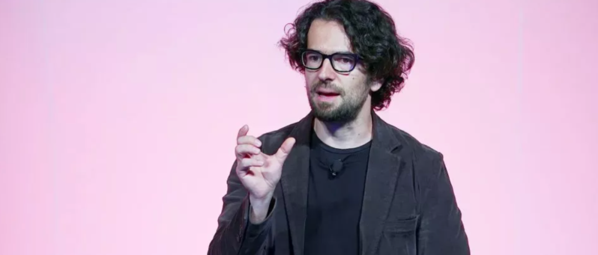

# 几周的工作量，20分钟干完！Redis 之父：手动敲代码的时代永远终结了

> 本文作者 antirez 是著名的[内存数据库软件 Redis](https://redis.io/ "Redis 实时数据平台") 的创造者。他的软件作品正支撑着全球数千万家企业的业务运行。 antirez 曾是 AI 怀疑论者，甚至通过写小说表达对人工智能自动化取代人类的担忧。但他最近的实践证明，编程的现实已经永远改变了。
> 在 antirez 的测试中，[**Claude Code**](https://www.claudezip.cn?utm_source=github&utm_medium=article&utm_campaign=claude-code-qidongqi "Claude Code 免安装启动器") 展现出了跨时代的效率。它能在 5 分钟内编写出 700 行逻辑严密、性能卓越的 C 语言代码。它能自主迭代，复现并修复 Redis 中极其棘手的死锁和定时漏洞。甚至连复杂的 Redis Streams 内部架构修改，它也仅需 20 分钟即可完成。
> antirez 认为现在的程序员不应再执着于逐行敲击代码，因为这在大多数情况下已不再明智。antirez 建议大家应该学习如何成为 AI 的优秀合伙人，将精力集中于定义问题和设计方案。
> 并励每一位开发者开始学习并深度使用 **Claude Code**。正如 antirez 所说的，**不要因为拒绝现实而错失掌控未来的机会。花几周时间去测试这些新工具，找到倍增自己效率的方法**。编程最纯粹的乐趣在于“构建”，而 AI 将让你构建得更多、更好、更快乐。

我喜欢写软件，一行一行地写。可以说，我的职业生涯，就是不断追求写出简洁、优雅、有品味的软件。
说实话，我并不希望 AI 在经济上大获全胜。我也不在乎现在的经济体系是否被 AI 颠覆——如果它朝着大规模财富再分配的方向走，我甚至会感到高兴。
但如果因为自己对软件和社会的看法，而故意装作看不见现实，那我就对不起自己的理性。**事实就是事实，AI 正在、而且必将永远改变计算机程序开发工作**。

2020 年，我辞掉工作，去写一部小说。内容是 AI、全民基本收入，以及一个为了适应劳动自动化、在各种挑战下发生改变的社会。
2024 年底，我开了一个播主频道，专门讨论 AI，它在编程任务中的用法，以及可能带来的各种影响。
虽然我很早就意识到这些变化会发生，但我一直以为，我们至少还有几年时间，编程才会被彻底重塑。现在我不再这么想了。
如今，借助最先进的大语言模型，只要你给出一组清晰的目标说明，就能几乎不需要人工辅助，独立完成大型子任务，甚至中等规模的项目。
效果好不好，取决于你做的是哪类编程（越是相对独立、越容易用文字完全描述的任务越适合，比如系统编程），也取决于你把问题在脑子里想清楚，并准确传达给模型的能力。
但总体来看，现在已经很清楚了：**除了纯粹为了好玩，在大多数项目里亲手写代码，已经不再是最理性的选择**。

过去一周里，我几乎只是在写提示词，偶尔检查一下代码、给点指导。就这样，我在几小时内完成了下面四件事，以前要花我几周时间。

我修改了自己的 linenoise 库，让它支持 UTF-8。
我还做了一个行编辑测试框架，里面有一个模拟终端，能报告每个字符格里显示的内容。
这件事我一直想做。但过去很难说服自己，为了一个小小的子项目，只是为了测试就投入这么多精力。
现在只需要把想法描述清楚，它就能变成代码。情况完全不同了。

我修复了 Redis 测试里偶发的失败。
这类工作非常烦人，涉及时间配合、TCP 死锁之类的问题。
Claude Code 持续迭代，花足够的时间去复现问题，检查各个进程的状态，弄清楚发生了什么，然后把 bug 修掉。

昨天，我想要一个纯 C 库，能做 BERT 类嵌入模型的推理。
Claude Code 用 5 分钟就把它写出来了。AI 在5分钟里写的库的输出效率和 PyTorch 差不多，只是慢了 15%。
整个库只有 700 行 C 代码。还顺带写了一个 Python 工具，用来转换 GTE-small 模型。

过去几周，我改动了 Redis Streams 的内部实现。
我为这些工作写了一份设计文档。
我把文档丢给 Claude Code，它在大概 20 分钟内就把我的工作全部重做了一遍。
耗时更长的部分是我自己在检查和确认命令。

现在发生的一切，已经不可能视而不见。
**大部分情况下，人类已经不再需要自己写代码**。
更有意思的部分，变成了弄清楚该做什么、怎么做。
在“怎么做”这一点上，大模型也是很好的搭档。
至于 AI 公司能不能收回投资，股市会不会崩盘，从长期看都不重要。
某个独角兽公司的 CEO 说的话多么刺耳或荒诞，也不重要。
无论怎样，编程已经被永久改变了。

对我来说，我写过的代码被大模型用来训练，是一件很棒的事。
我把这看作是我一生追求的延续：**让代码、系统和知识更大众化。**
大语言模型会帮我们更快地写出更好的软件。
也会让小团队有机会和大公司竞争。
就像 90 年代的开源软件做过的那样。

作为程序员，现在我比以往任何时候都更想写开源。
我想把一些因为时间不够而被搁置的仓库重新捡起来改进。
我想在自己的 Redis 工作流里全面用上 AI。
先改进 Vector Sets 的实现，然后再轮到其他数据结构，就像我现在在改 Streams 一样。

但我为那些会被裁掉的人感到担心。
现在还看不清具体会发生什么变化。
公司也许会想要更多人，去做更多事情。
也有可能相反，只留下更少、但更擅长使用 AI 的程序员，以此压缩薪资成本。
我也担心，在其他很多行业里，人类可能会变得几乎完全可被替代。

关于如何编程。
我只有一个建议，送给你这位朋友。
无论你心里认为什么是“正确的事”，都无法通过否认现实来影响它的发展。
选择不用 AI，对你和你的职业都没有好处。
好好想想。
认真地去试这些新工具。
花上几周时间，而不是随便玩五分钟，只为了证明自己原来的看法。
想办法让自己“倍增”。
如果一开始没找到合适的用法，隔几个月再试一次。

也许你会想，自己当初那么辛苦学会编程，现在机器却替你写代码。
可那时支撑你熬夜写到深夜，只为看到项目跑起来的那团火，其实是“创造”。
如果你找到适合自己的方式，高效地用好 AI，你就能创造得更多，也能创造得更好。
乐趣仍然在那里，完好无损。
