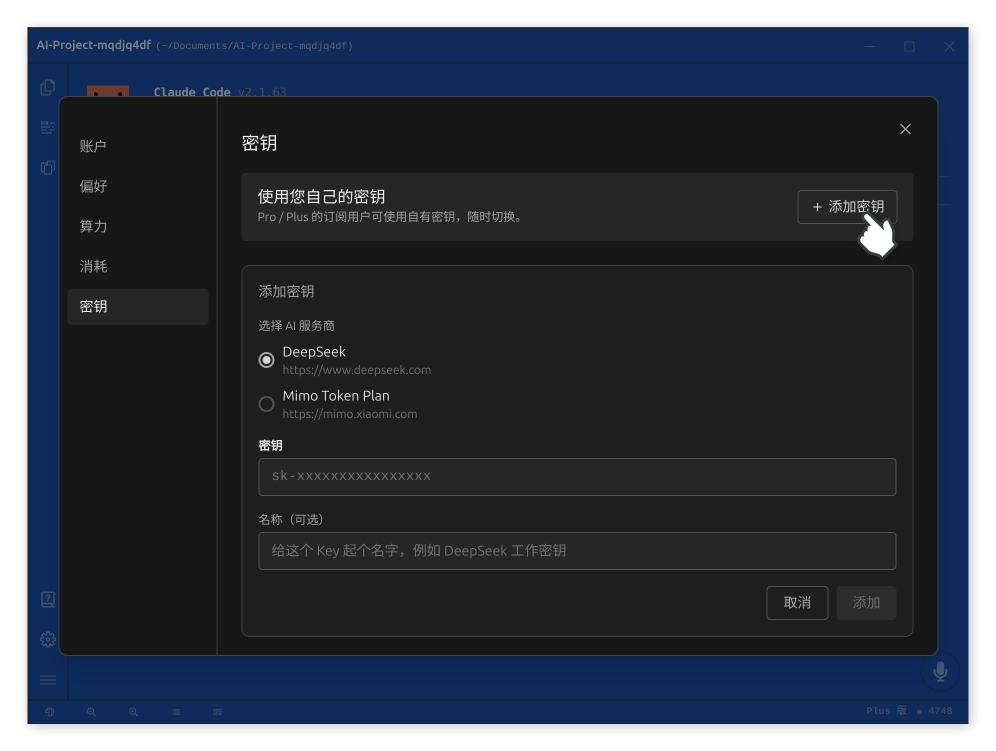
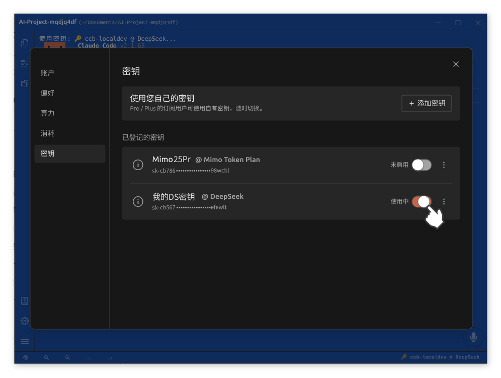
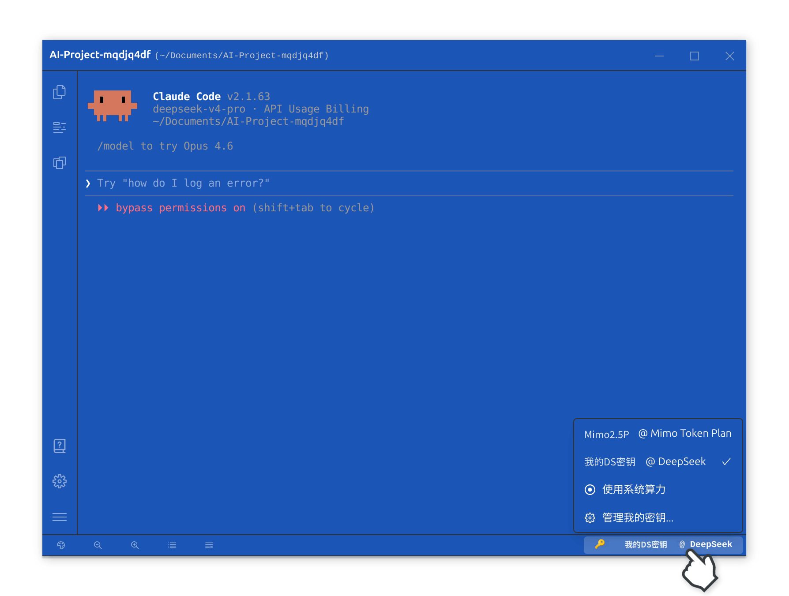

# Claude Code 中直接使用 Deepseek v4 模型

Claude Code 凭借其出色的任务调度与交付质量，已成为众多开发者的核心编程工具。然而，Claude 系列模型的调用成本相对较高，对于日常高频使用场景而言，长期开销不容忽视。

DeepSeek V4 是深度求索公司推出的新一代大语言模型，在保持出色推理能力的同时，其 API 调用价格极具竞争力。[Claude Code 启动器](https://www.claudezip.cn?utm_source=github&utm_medium=article&utm_campaign=claude-code-qidongqi)提供了 **自带密钥（Bring Your Own Key，简称 BYOK）** 功能，使用者只需填入自有 API 密钥，即可在 Claude Code 中无缝使用 DeepSeek V4 模型，兼顾质量与成本。

## 模型价格对比（DeepSeek V4 的价格不到 Claude 价格的 5%）

根据第三方 AI 服务提供商的公开价格数据，DeepSeek V4 的调用成本远低于主流同类模型：

具体而言，**DeepSeek V4 的价格仅为 Claude Opus 模型的约二十分之一**，部分场景下甚至可达七十分之一。这意味着，在同等预算下，使用者可以获得数倍乃至数十倍的调用次数，显著降低 AI 编程的长期使用成本。

## 为什么需要 BYOK

在 Claude Code 中使用第三方模型，传统上有以下几种方式：

- **修改环境变量**：需要手动编辑系统环境变量或配置文件，操作繁琐且容易出错。不同操作系统的配置方式各异，对不熟悉系统配置的使用者而言门槛较高。
- **搭建中转代理**：通过路由转发服务对接第三方模型，不仅部署过程复杂，还可能出现连接不稳定的问题，影响 Claude Code 的核心使用体验。

这两种方案的共同缺陷是：操作路径长、容易出错、且缺乏直观的图形界面来管理多个密钥。[Claude Code 启动器](https://www.claudezip.cn?utm_source=github&utm_medium=article&utm_campaign=claude-code-qidongqi)的 BYOK 功能正是为解决这些问题而设计的。

## 配置步骤

### 第一步：打开密钥管理面板

点击启动器界面中的「设置」按钮，然后选择「密钥」选项卡，进入密钥管理面板。

### 第二步：添加 DeepSeek API 密钥

在密钥管理面板中：

1. 点击「添加密钥」按钮；
2. 在密钥输入框中，粘贴从 DeepSeek 官网获取的 API 密钥；
3. 点击「添加」完成登记。

密钥登记成功后，还需手动开启该密钥对应的开关按钮，才能正式启用 DeepSeek V4 模型。

### 第三步：在 Claude Code 中启用 Deepseek 模型

启用开关后，Claude Code 便会自动切换至 DeepSeek V4 模型。此后在对话输入框中发出的每条指令，都将由 DeepSeek V4 进行处理。

整个配置过程无需修改任何系统文件，也无需在终端中执行任何命令。所有操作均在图形界面中完成，直观清晰。

## 模型切换

[Claude Code 启动器](https://www.claudezip.cn?utm_source=github&utm_medium=article&utm_campaign=claude-code-qidongqi)提供了两种模型切换方式，使用者可根据场景灵活选择。

### 方式一：通过密钥管理面板切换

进入设置中的密钥管理面板，通过开启或关闭各密钥对应的开关，即可在不同模型之间切换。关闭当前密钥的开关将恢复默认模型，启用其他已登记的密钥则切换至对应的第三方模型。

### 方式二：通过快捷菜单切换

除了在设置面板中操作外，[Claude Code 启动器](https://www.claudezip.cn?utm_source=github&utm_medium=article&utm_campaign=claude-code-qidongqi)还在窗口右下角提供了快捷切换入口。点击该区域后，会弹出当前所有可用模型的列表，使用者只需点击目标模型即可一键切换，无需进入设置面板。

这种方式省去了逐层打开设置的操作路径，尤其适合需要在不同模型之间频繁切换的使用场景。

[Claude Code 启动器](https://www.claudezip.cn?utm_source=github&utm_medium=article&utm_campaign=claude-code-qidongqi)支持同时登记多个模型的 API 密钥，使用者可以根据任务类型和预算灵活选择当前使用的模型。

## 其他支持的模型

除 DeepSeek V4 外，[Claude Code 启动器](https://www.claudezip.cn?utm_source=github&utm_medium=article&utm_campaign=claude-code-qidongqi)的 BYOK 功能还支持其他第三方模型。使用者可根据自身需求，在密钥管理面板中添加对应的 API 密钥并启用。具体支持的模型列表，请以启动器界面的最新显示为准。

## 总结

[Claude Code 启动器](https://www.claudezip.cn?utm_source=github&utm_medium=article&utm_campaign=claude-code-qidongqi)的 BYOK 功能，为使用者提供了一种简洁、可靠的第三方模型接入方案。通过这一功能，使用者可以：

- **显著降低使用成本**：以 DeepSeek V4 仅为 Claude 模型数十分之一的价格，大幅降低高频编程场景下的开销；
- **无需复杂配置**：无需修改环境变量或搭建中转服务，在图形界面中填入密钥即可完成所有设置；
- **灵活切换模型**：支持同时管理多个 API 密钥，根据任务需求自由切换模型。

善用 BYOK 功能，既能享受 Claude Code 出色的任务调度与交付能力，又能合理控制使用成本，是高效、经济的 AI 编程实践方式。
