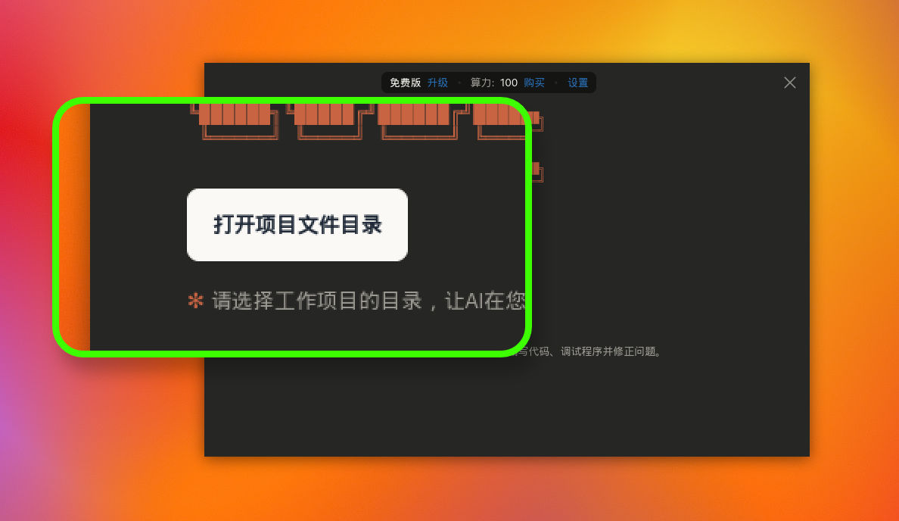
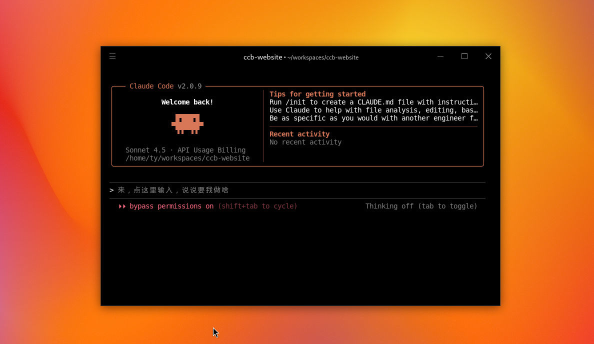
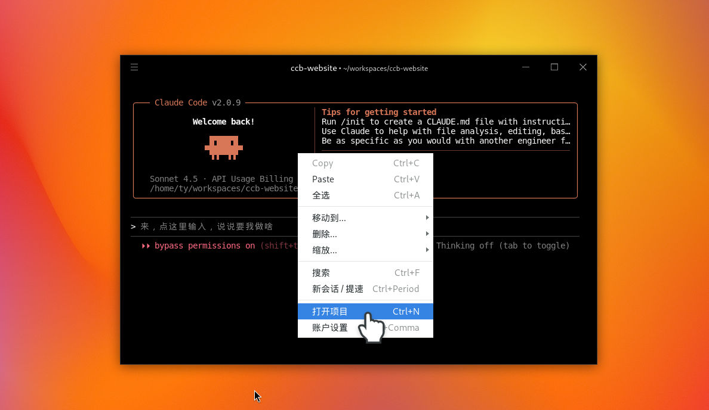

# 3 分钟上手 Claude Code：让 AI 成为你的超级编程助手

继上篇安装教程之后，今天我们直接进入实战。如果你是刚接触 AI 编程的新手，千万别被“编程”这两个字吓到。Claude Code 的设计初衷就是为了让开发变得超级简单。

## 第一步：开启你的“工作目录”

当你第一次启动 Claude Code 时，迎接你的是一个非常简洁的初始画面。屏幕中心最醒目的就是 “打开项目文件目录” 按钮。

什么是“工作目录”？ 简单来说，它就是你存放代码项目的文件夹。为什么要选择它？ 因为 Claude Code 是一个非常守纪律的 AI。它会明确地告知用户：请选择工作项目目录，以便让 AI 在你指定的项目中自动编写代码、调试程序并修正问题。你可以把它想象成给 AI 划定了一个“专属施工区”，它所有的操作都会严格限制在这个范围内。

## 第二步：直观的交互界面

选好目录后，我们就进入了核心操作界面。虽然看起来很专业，但其实一目了然：

1. 顶端路径显示： 在窗口的最上方，你可以清晰地看到当前项目的完整路径（例如：~/workspaces/ccb-website）。这个设计非常贴心，当你同时处理多个任务时，只需看一眼顶部，就能确认 AI 正在哪个文件夹里忙活，绝不会搞混。
2. 吉祥物与状态： 画面中间可以看到 Claude Code 的版本号（如 v2.0.9）以及那个标志性的像素风吉祥物。看到它，就说明你的 AI 助手已经准备就绪，处于“随时待命”的状态。
3. 核心交互区： 界面下方有一行灰色的提示字：“来，点这里输入，说说要我做啥”。这就是你下达指令的地方。只需用鼠标点击并输入需求（比如“帮我写一个登录页面”），Claude Code 就会开始深度分析，制定详细的工作计划并像资深程序员一样执行。

## 第三步：多任务并行处理

如果你手头有多个项目需要处理，Claude Code 也能轻松应对。根据操作提示，你可以随时通过鼠标右键菜单选择“打开项目”，或者直接使用快捷键 Ctrl + N 来开启新项目。你甚至可以同时开启多个窗口，让 Claude Code 在不同的项目里同步“打工”，效率直接拉满！

## 总结
使用 Claude Code 就像是请了一位自带工具箱的超级管家。你选定一个房间（工作目录）让他进去，然后在门口的小黑板（输入框）上写下任务。这位管家不仅能看懂你的需求，还能自己规划步骤，把房间打理得井井有条。如果你有多个房间需要打扫，只需多开几个窗口，请几位管家同时工作即可！
希望这篇指南能帮你快速开启 AI 编程之旅。如果你觉得有帮助，别忘了关注我的频道，我们下期见！
