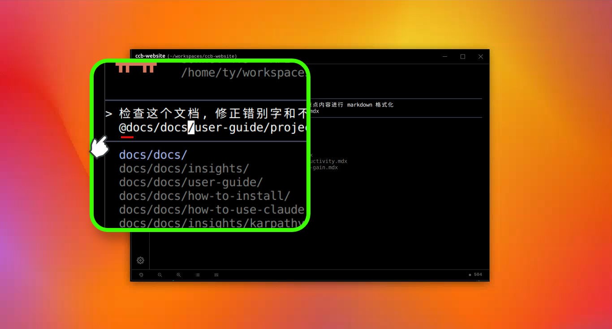

#  如何在 Claude Code 中引用文件和目录

当我们需要指挥  Claude Code 处理具体的文件时，我们通常会输入 `@` 符号来引用那个文件或目录。
具体的做法是在下达指令的聊天对话框中，输入 `@ ` 符号后，Claude Code 会显示当前目录下的文件列表。然后我们只需要输入这个文件路径的关键词，就可以按上下键来选中所要引用的文件。用同样的操作，也可以直接引用目录。

## 引用文件和目录的语法

基本语法涉及输入 `@` 后跟文件或目录路径:

- 引用特定文件: `@path/to/your/file.js` ——  这将把文件的完整内容包含在当前的任务对话上下文中。

- 引用目录: `@path/to/your/directory/` ——  这将提供包含文件信息的目录列表，但不会包含其中所有文件的内容。我们可以在引用目录之后告诉 Claude Code 想要它读取的文件类型。

## 使用 @ 的具体操作示例

**示例 1: 查看文件内容**

提示词： `请帮我阅读 @src/components/Header.js 并解释其主要功能` ——  Claude Code 会自动读取 Header.js 的内容并进行分析。

**示例 2: 同时引用多个文件**

提示词： `对比 @src/styles/main.css 和 @src/styles/mobile.css 的差异` ——  Claude 会同时读取两个 CSS 文件并进行比较分析。

**示例 3: 引用目录查看结构**

提示词： `列出 @src/api/ 目录下的所有文件,并简要说明每个文件的作用` ——  Claude 会展示目录结构并分析各个文件。

## 总结
虽然命令行 `@` 引用是标准操作，但在处理大型项目长路径或中文文件名时，纯键盘输入存在易出错及交互割裂等局限性。因此，我们推荐使用[图形界面文件树功能](use-file-explorer.md "简单直观的文件操作：使用项目文件面板")来快速插入文件引用。
