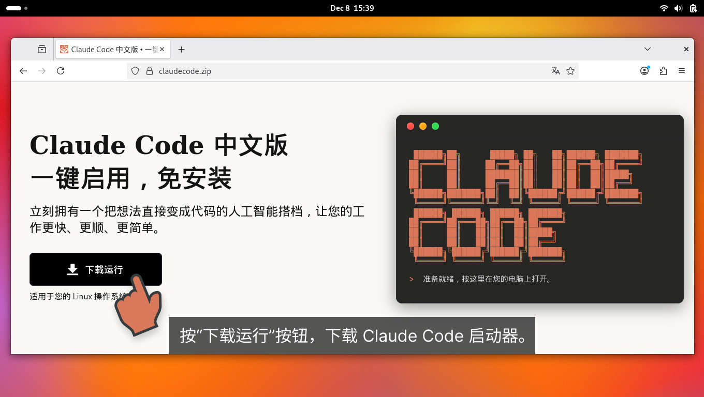
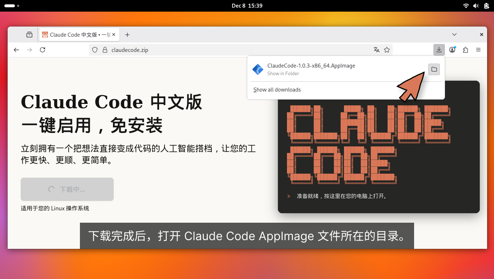
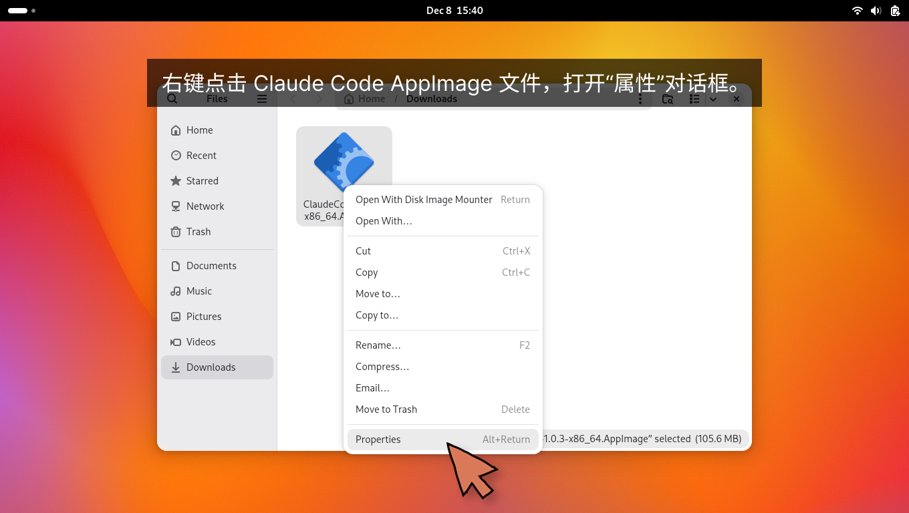
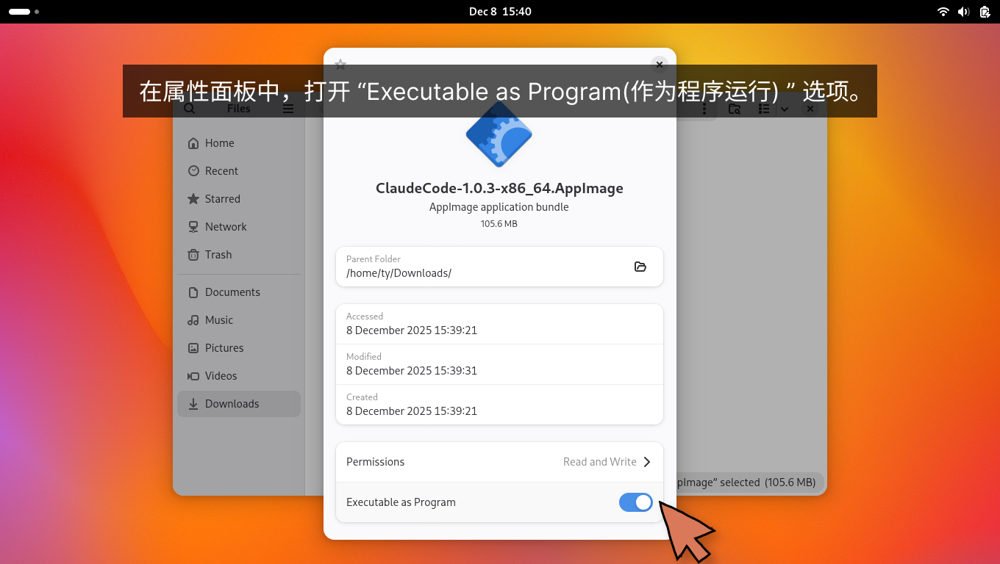
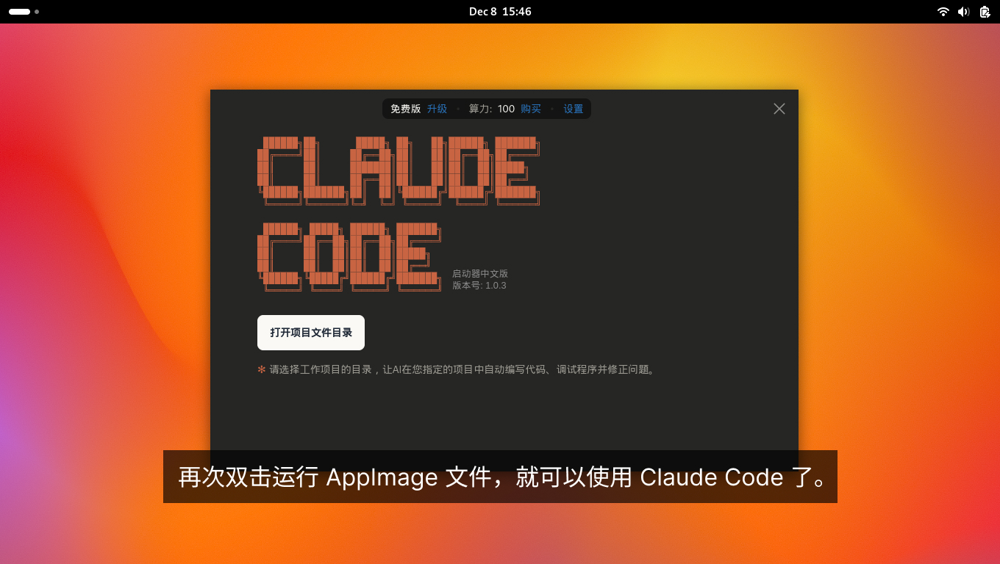

# 在 Linux 上免安装地使用 Claude Code

这篇图文说明教您在 Linux 系统的电脑上，如何通过简单的操作下载和使用 [Claude Code 启动器](https://www.claudezip.cn?utm_source=github&utm_medium=article&utm_campaign=claude-code-qidongqi)。

## [Claude Code 启动器](https://www.claudezip.cn?utm_source=github&utm_medium=article&utm_campaign=claude-code-qidongqi)系统要求

- **系统**: 各类流行的 Linux 发行版的 64 位版本
- **内存**: 4GB
- **存储**: 至少 1GB 可用空间
- **网络**: 可以访问互联网

## [Claude Code 启动器](https://www.claudezip.cn?utm_source=github&utm_medium=article&utm_campaign=claude-code-qidongqi)安装步骤

**第一步：** 打开您的电脑的网络浏览器，点击网址框，输入网址： **[`claudezip.cn`](https://www.claudezip.cn?utm_source=github&utm_medium=article&utm_campaign=claude-code-qidongqi)** 。然后按回车，打开 Claude Code 免安装中文版的中文网站。


**第二步：** 按“下载运行”按钮，下载 [Claude Code 启动器](https://www.claudezip.cn?utm_source=github&utm_medium=article&utm_campaign=claude-code-qidongqi)。



**第三步：** 下载好后，打开 [Claude Code 启动器的 AppImage](https://www.claudezip.cn?utm_source=github&utm_medium=article&utm_campaign=claude-code-qidongqi) 文件所在的目录。


**第四步：**  右键点击 [Claude Code 启动器 AppImage](https://www.claudezip.cn?utm_source=github&utm_medium=article&utm_campaign=claude-code-qidongqi) 文件，打开“属性”对话框。


**第五步：**  在属性面板中，打开 “Executable as Program(作为程序运行) ” 选项。


**安装完成** 再次双击运行 AppImage 文件，就可以使用 Claude Code 了。


## 使用 [Claude Code 启动器](https://www.claudezip.cn?utm_source=github&utm_medium=article&utm_campaign=claude-code-qidongqi)时的常见问题

### 故障: 已经开启了 AppImage 文件的执行权限，但是双击后仍然无法运行 Claude Code

> **提示**:  [Claude Code 启动器的 AppImage](https://www.claudezip.cn?utm_source=github&utm_medium=article&utm_campaign=claude-code-qidongqi) 可以在命令行终端中启动，这样可以看到详细的错误信息。

**故障排查**

 1. 打开终端，切换到 Claude Code 的 AppImage 文件所在的目录。
 2. 输入 `./ClaudeCode.AppImage` 命令，然后按回车运行 Claude Code。

**报错信息**

```bash
⛔ ./ClaudeCode-1.0.3-x86_64.AppImage: Permission denied
```

**解决方法**

这个报错信息表明 AppImage 文件没有执行权限。请在终端中运行以下命令，为 AppImage 文件添加执行权限：

```bash
chmod +x ClaudeCode-1.0.3-x86_64.AppImage
```

然后重新运行 [Claude Code 启动器的 AppImage](https://www.claudezip.cn?utm_source=github&utm_medium=article&utm_campaign=claude-code-qidongqi) 文件，即可解决该问题。

**报错信息**

```bash
⛔ dlopen(): error loading libfuse.so.2

AppImages require FUSE to run.
You might still be able to extract the contents of this AppImage
if you run it with the --appimage-extract option.
See https://github.com/AppImage/AppImageKit/wiki/FUSE
for more information
```

**解决方法**

[Claude Code 启动器的 AppImage](https://www.claudezip.cn?utm_source=github&utm_medium=article&utm_campaign=claude-code-qidongqi) [依赖 libfuse2 模块来运行](https://github.com/appimage/appimagekit/wiki/fuse "AppImageKit 的关于 FUSE 的详细说明")。请按照以下步骤安装 FUSE：

```bash
sudo apt update
sudo apt install libfuse2
```

如果提示找不到包名，再试 Debian/新发行版可能采用的 t64 名称：

```bash
sudo apt install libfuse2t64
```

然后重新运行 [Claude Code 启动器的 AppImage](https://www.claudezip.cn?utm_source=github&utm_medium=article&utm_campaign=claude-code-qidongqi) 文件，即可解决该问题。

### 故障: 运行 [Claude Code 启动器](https://www.claudezip.cn?utm_source=github&utm_medium=article&utm_campaign=claude-code-qidongqi)的时候报错说： 无法连接服务器，请检查网络


**解决方法**

这个报错表明终端无法与大模型服务器建立连接，导致无法调用人工智能模型完成任务。可能的原因有以下两种，请逐一排查：

**1. 网络连接问题**

请检查计算机是否能正常访问互联网。最简便的方法是打开浏览器，输入任意网址（如 `www.baidu.com` ）进行测试。若能正常打开网页，说明网络连接正常；否则，请检查网络设置。

**2. 系统时钟不同步**

终端与服务器之间的通信采用加密协议，该协议对时间校验要求严格。如果您的电脑时间与标准时间误差超过1小时，将导致通信失败。请将系统时钟调整为正确时间：

* 系统设置 → 通用 → 日期与时间 → 勾选"自动设置日期与时间"

调整好系统时钟后，重新打开 [Claude Code 启动器的 AppImage](https://www.claudezip.cn?utm_source=github&utm_medium=article&utm_campaign=claude-code-qidongqi) 文件，即可解决该问题。
