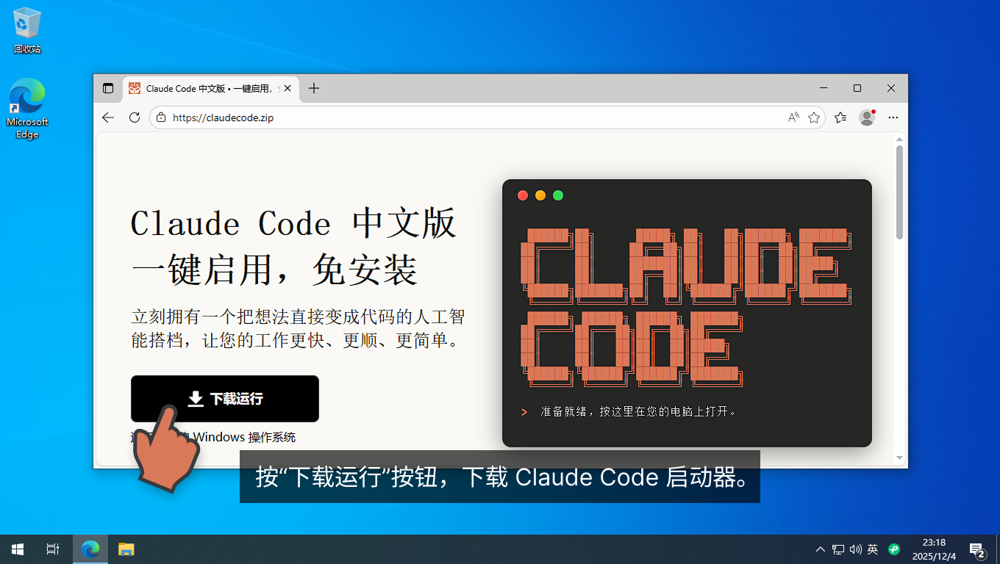
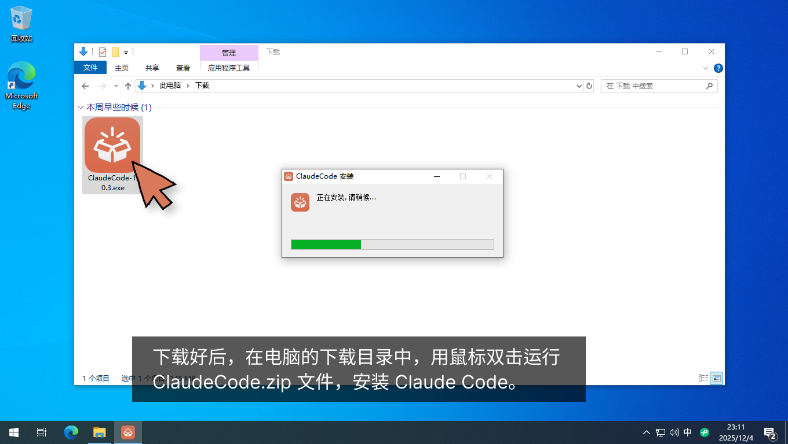
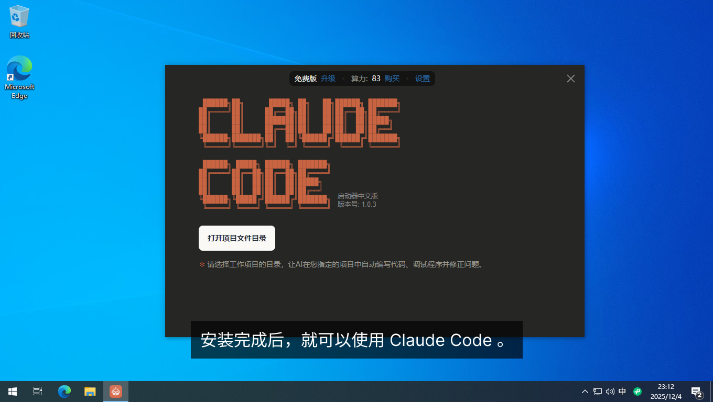

# 在 Windows 系统上免安装地使用 Claude Code

这篇图文说明教您在 Windows 系统的电脑上，如何通过简单的操作下载和使用 [Claude Code 启动器](https://www.claudezip.cn?utm_source=github&utm_medium=article&utm_campaign=claude-code-qidongqi)。

## [Claude Code 启动器](https://www.claudezip.cn?utm_source=github&utm_medium=article&utm_campaign=claude-code-qidongqi)的系统要求

- **系统**: Windows 10 或 Windows 11
- **内存**: 至少 4GB
- **存储**: 至少 1GB 可用空间
- **网络**: 可以访问互联网

## [Claude Code 启动器](https://www.claudezip.cn?utm_source=github&utm_medium=article&utm_campaign=claude-code-qidongqi)的安装步骤

**第一步：** 打开您的电脑的网络浏览器，点击网址框，输入网址： **[`claudezip.cn`](https://www.claudezip.cn?utm_source=github&utm_medium=article&utm_campaign=claude-code-qidongqi)** 。然后按回车，打开 [Claude Code 免安装启动器](https://www.claudezip.cn?utm_source=github&utm_medium=article&utm_campaign=claude-code-qidongqi)的中文网站。

**第二步：** 按“下载运行”按钮，下载 [Claude Code 启动器](https://www.claudezip.cn?utm_source=github&utm_medium=article&utm_campaign=claude-code-qidongqi)。

**第三步：** 下载好后，在电脑的下载目录中，用鼠标双击运行 ClaudeCode.zip 文件，安装 [Claude Code 启动器](https://www.claudezip.cn?utm_source=github&utm_medium=article&utm_campaign=claude-code-qidongqi)。

**安装完成** 这样就可以使用 Claude Code 了。

---

## 使用 Claude Code 时的常见问题

### 故障: 运行 [Claude Code 启动器](https://www.claudezip.cn?utm_source=github&utm_medium=article&utm_campaign=claude-code-qidongqi)的时候报错说： 无法连接服务器，请检查网络

**解决方法**

这个报错表明终端无法与大模型服务器建立连接，导致无法调用人工智能模型完成任务。可能的原因有以下三种，请逐一排查：

**1. 网络连接问题**

请检查计算机是否能正常访问互联网。最简便的方法是打开浏览器，输入任意网址（如 `www.baidu.com` ）进行测试。若能正常打开网页，说明网络连接正常；否则，请检查网络设置。

**2. 系统时钟不同步**

终端与服务器之间的通信采用加密协议，该协议对时间校验要求严格。如果您的电脑时间与标准时间误差超过1小时，将导致通信失败。请将系统时钟调整为正确时间：

* Windows：右键点击任务栏时间 → 调整日期/时间 → 开启"自动设置时间"

* MacOS：系统设置 → 通用 → 日期与时间 → 勾选"自动设置日期与时间"

调整好系统时钟后，重新打开 [Claude Code 启动器](https://www.claudezip.cn?utm_source=github&utm_medium=article&utm_campaign=claude-code-qidongqi)，即可解决该问题。

**3. 防火墙拦截**

Windows 防火墙可能阻止了该软件的网络访问权限。请按以下步骤放行：

1. 打开 Windows 安全中心
2. 选择 防火墙和网络保护 → 允许应用通过防火墙
3. 点击"更改设置"，找到并勾选 [Claude Code 启动器](https://www.claudezip.cn?utm_source=github&utm_medium=article&utm_campaign=claude-code-qidongqi)应用程序
4. 确认保存设置
