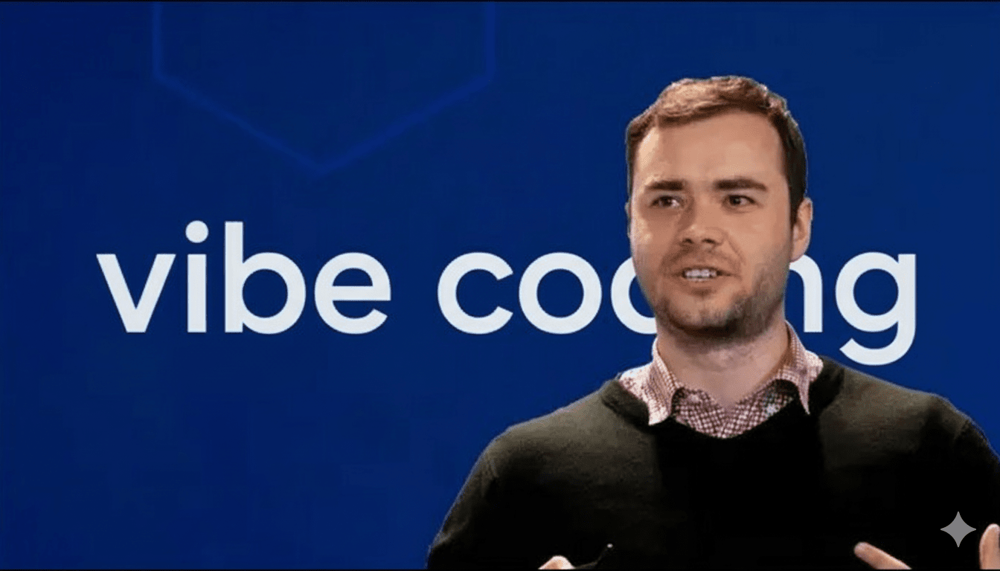

# 来自 Andrej Karpathy 的提醒：未来的程序员分两种：会用 AI 写代码的，和被淘汰的

> [以下的博文的作者是 Andrej Karpathy](https://x.com/karpathy/status/2015883857489522876  "查看 Andrej Karpathy  的博客原文")。他是 AI 领域公认的大神。曾经在特斯拉当 AI 总监，负责自动驾驶的核心系统。他也是 OpenAI 的早期成员，参与过 ChatGPT 这类技术的基础工作。还在美国斯坦福大学教过著名的计算机视觉课。现在他在创业做 AI 教育。
>
>
> 他从学术界到大厂，从研究到产品，经历特别全。所以，他不是站在圈外“聊概念”的人。他是从最早一批深度学习，到自动驾驶，再到现在大模型和写代码的 AI 工具，都亲自冲在一线的人。他自己写了很多年代码，也亲手带过大团队。
> 因此，他对“AI 怎么改变写代码这件事”的感受和判断，非常值得参考。
>
>
> Karpathy 用亲身实践证明，**用 [Claude Code](https://www.claudezip.cn?utm_source=github&utm_medium=article&utm_campaign=claude-code-qidongqi "Claude Code 中文启动器") 这类工具，不是简单的"自动补全"，而是给开发效率加杠杆**。同样的时间，你能搞定以前十倍的工作量，甚至敢碰以前不敢做的复杂项目。当然 AI 也会犯错、会把代码写复杂，需要你盯着，但总体是质的飞跃。
>
> 无论是资深程序开发专家，还是准备学编程的小白，Karpathy 都建议 **尽早开始用 [Claude Code](https://www.claudezip.cn?utm_source=github&utm_medium=article&utm_campaign=claude-code-qidongqi "Claude Code 中文启动器") 这类工具**。这不是锦上添花，而**是给自己的开发能力加杠杆**。同样的时间，你能做以前十倍的事，甚至能挑战以前完全不敢碰的项目。 AI年代的开发流程已经完全进化了，**越早适应，优势越大**。

最近几周我用 [Claude Code](https://www.claudezip.cn?utm_source=github&utm_medium=article&utm_campaign=claude-code-qidongqi "Claude Code 中文启动器") 写了很多代码。 下面是一些随手记下来的想法。

## Coding workflow（写代码的流程）

因为最近一波 LLM 写代码的能力又提升了。和很多人一样，我在 11 月的时候，大概是：80% 靠自己手敲 + IDE 自动补全，20% 用代码助手（Agent）。到了 12 月，已经完全反过来了：80% 是让 Agent 写代码，20% 是我自己改一改、修修补补。

也就是说，现在我其实主要是在用英文“说话写代码”。我一边有点不好意思，一边跟 LLM 讲：“你帮我写一段这样的代码”，全是用文字描述。

这对程序员自尊心确实有点打击。但它能一次性对一大块软件做“大号代码操作”，整体效率实在太香了。尤其是当你适应了它，把配置调好，学会怎么用，搞清楚它能做什么、不能做什么之后。

对我来说，这已经是我差不多 **20 年写代码生涯里，对“开发工作流”影响最大的一次变化**。而且就只是在短短几周内发生。我猜，现在已经有不少工程师（两位数百分比那种）在经历类似的变化。但在普通人那里，对这件事的认知，感觉还停留在很低的个位数百分比。

## IDEs / Agent 群 / 会犯错这件事

现在网上有两种吹法：“IDE 以后都不需要了”和“Agent 群自己协作就能搞定一切”。我个人觉得，现在这个阶段，这两种说法都吹得太过了。

模型还是会犯错的。如果这份代码是你真正关心的项目，我建议你一定要盯紧。最好旁边开一个窗口，用一个大的 IDE 看着，就像老鹰盯猎物那样。

错误的类型已经变了。不再是那种简单的语法错误。而是一些比较细、比较隐蔽的概念错误。就好像一个有点毛躁、赶时间的初级工程师可能会犯的那种错。

最常见的一类问题：模型会替你“脑补”一些前提。但它脑补错了，也不会回头确认。它就直接在这个错误前提上继续一路写下去。

它们也不会好好管理自己的“困惑”。不会主动问你：“这地方你到底想要 A 还是 B？”不会主动帮你指出前后不一致的地方。不会帮你列清楚不同方案的取舍。该反驳你的时候，它也不怎么反驳。整体还是有点“太会附和人”的那种感觉。但如果**让它先写一个“计划”，再按计划执行，情况会好不少**。不过我觉得还挺需要一种“轻量的、嵌在代码里的计划模式”。它们还特别喜欢把代码和 API 写得过于复杂。抽象层级越叠越厚，变得很臃肿。写完之后也不主动清理自己制造出来的“死代码”。

有时候它能写出一坨一千多行的实现。又慢、又复杂、又脆弱，到处是绕路。
然后你轻轻问一句：“我们能不能直接用这个更简单的写法？”它立刻说：“当然可以！”然后马上给你缩成一百来行。

有时它还会顺手改掉，甚至删掉一些注释和代码。只因为它“不喜欢”或者没完全看懂。哪怕这些东西和当前任务完全没关系。这些问题，哪怕我已经在 CLAUDE.md 里写了一些使用说明，提醒它注意这些点，还是会时不时出现。即便如此，从整体效果看，还是提升巨大。现在真的很难想象再完全回到纯手写代码的时代。

简单说，每个人都有自己的开发节奏。我现在的做法是：左边在 Ghostty 里开几个 [Claude Code](https://www.claudezip.cn?utm_source=github&utm_medium=article&utm_campaign=claude-code-qidongqi "Claude Code 中文启动器") 会话，右边开 IDE，用来看代码和手动修改。

## Tenacity（韧性 / 耐力）

看一个 Agent 死磕一个问题，其实挺有意思的。**它不会累。不会心态崩**。人早就会说“算了，改天再战”的地方，它还能一直试、一直试。

有时候你看着它挣扎了很久。结果 30 分钟后，它终于搞定了。那一刻会有点“哇，真的**有点 AGI 味道”的感觉**。

你会突然意识到：**原来“体力和精力”真的是工作里的一个核心瓶颈**。而有了 LLM，这方面的上限被拉高了很多。

## Speedups（提速）

LLM 帮你提速，到底是快了几倍，其实很难量化。我确实感觉，在我原本就要做的那些事上，整体是快了很多。但更大的变化是：我现在会做更多事情。

原因大概有两点：
1）以前很多“懒得写”“不值得花时间写”的小东西，现在可以顺手就写。
2）以前因为自己知识或技能不够而不敢动的代码，现在也敢下手了。

所以，这当然是加速。但可能更重要的是，它让“我能做的事的范围”扩大了很多。

## Leverage（杠杆感）

LLM 有一个特别厉害的地方：**它很会一遍遍循环尝试，直到满足你设定的具体目标**。很多“有 AGI 味道”的体验，就是在这里出现的。

**关键点是：不要一条一条命令它怎么做。而是告诉它：“什么样算成功。”然后看它自己去折腾。**

比如，你可以让它先写测试。然后再让它去通过自己写的这些测试。或者，把它和浏览器之类的工具（通过 MCP 接起来）放在一个循环里。再比如，你先写一个非常朴素、但几乎肯定正确的算法。然后让它在保证结果不变的前提下，帮你优化性能和结构。

整体思路，可以从“命令式”变成“声明式”：不再是“你先做 A，再做 B，再做 C”，而是“我要的结果长这样”。这样 Agent 会自己多迭代几轮，你就多拿了一层“杠杆”。

## Fun（好不好玩）

我原本没想到，有了 Agent 之后，写代码反而会“更好玩”。很多枯燥的“填空题式”的工作被它接过去了。留下来的更多是有创意的部分。

我也没那么容易卡死在一个地方。被卡住一点都不好玩。现在往往总能找到一种：“我和它一起合作，至少往前挪一点点”的方式。这会让人更有勇气开工。

当然，我也看到过完全相反的感受。有些人觉得 LLM 写代码让他们更不开心。

**长期来看，这件事可能会把工程师分成两类：一类是主要喜欢“写代码这件事本身”的人。另一类是主要喜欢“把东西做出来”的人。**

## Atrophy（能力退化）

我已经能感觉到：自己“手写代码”的能力在慢慢退化。在大脑里，“生成”（自己写代码）和“辨别”（看懂、审代码）其实是两种不同的能力。因为写代码要记一堆细碎的语法细节。而看代码主要是理解思路和结构。所以就算你已经有点写不动了，你仍然可以很好地审查代码，看哪里怪怪的、哪里有 bug。

## Slopacolypse（粗糙内容大爆发）

我在心理上已经做好准备：2026 年可能会成为“水货内容大爆发”的一年。

GitHub、Substack、arXiv、B站 / 知乎……以及各种数字内容平台上，都会出现海量 AI 生成的东西。我们会看到更多围绕 AI 的“生产力表演秀”。
就是那种“看起来好厉害”的展示。当然，其中也会夹着很多真正的、实实在在的效率提升。

## Questions（一些我在想的问题）

所谓“**10 倍工程师**”会变成什么样？
也就是：普通工程师和最强工程师之间的效率差距，会变得更大吗？非常有可能，**会变得大很多**。

有了 LLM 之后，“通才”会不会越来越能干过“专才”？
因为 LLM 在“补细节、填空白”（微观）方面特别强，但在“大局观、长期策略”（宏观）上就没那么厉害。

未来用 LLM 写代码，会是什么感觉？
像在打《星际争霸》？像在玩《Factorio》（异星工厂）？还是更像在演奏一段音乐？

整个社会里，有多少东西，其实都卡在“数字化知识工作”的瓶颈上？

## 总结：这把我们带到什么位置？

LLM 的 Agent 能力（尤其是 Claude Code），在 2025 年 12 月左右，感觉是跨过了某个“整体连贯性”的门槛。这在软件工程和相关领域里，引发了一次“相变”。也就是，做事的方式突然变了一个层级。

现在的感觉是：在“智能”这一块，它已经明显走在其它配套东西前面了。

比如：
工具和知识库的集成还没完全跟上。
团队内部需要新的工作流和协作方式。
整个行业对这些东西的消化和扩散，还在路上。

**2026 年会是一个“能量很高”的年份。**
整个行业都在努力消化、吸收这项新能力。
