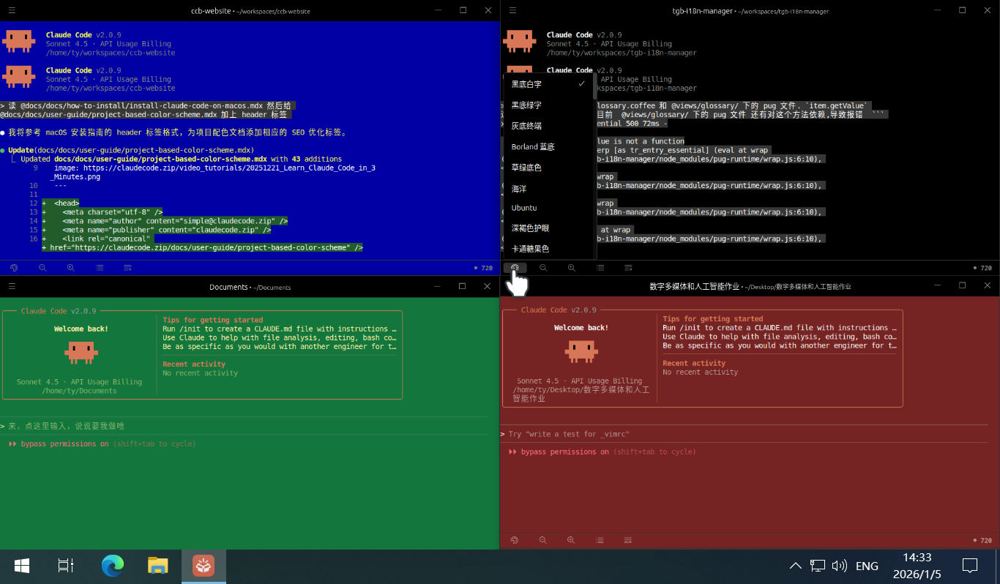
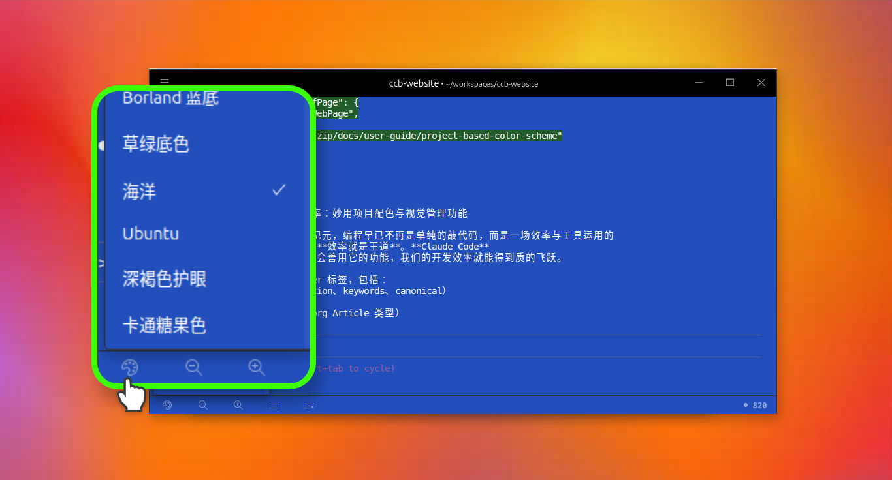

# 提升多任务开发效率：妙用项目配色与视觉管理功能

我们已进入人工智能纪元，编程早已不再是单纯的敲代码，而是一场效率与工具运用的竞赛。写代码的时候，**效率就是王道**。**Claude Code** 确实非常强大，只要学会善用它的功能，我们的开发效率就能得到质的飞跃。

## **多开功能：每个人都是一个世界顶级的开发团队**

Claude Code 最厉害的一点就是**支持多开**。因为它是一个 **Terminal 终端应用，因此完全不受操作系统图形界面的局限**。我们可以同时运行多个 Claude Code 窗口，让它们分工协作。

在开发网络应用、微信小程序或手机 APP 时，这种模式特别高效：我们可以安排一个 Claude Code 写前端，一个开发服务器接口，再放一个专门负责运行调试。**这操作简直就像给自己雇佣了一个全球最牛的开发团队**，他们任劳任怨，随时待命，能帮我们省下大量的时间和精力。

## **项目配色：一眼区分任务，告别“眼花缭乱”**

以前窗口开多了，最头疼的就是分不清哪个是哪个，因为每个窗口颜色都一样，只能盯着顶部的目录名看。

现在，新版 [Claude Code 启动器](https://www.claudezip.cn?utm_source=github&utm_medium=article&utm_campaign=claude-code-qidongqi)上线了**项目配色功能**，完美解决了这个问题：
*   **百种方案随心选**：在窗口底部的快捷工具栏里，点击“选择配色方案”就能看到几十种配色。无论是经典的 Ubuntu Linux 风格，还是号称最养眼的 Solarized 方案，甚至是非常经典的 **Borland 蓝**，应有尽有。
*   **按项目设置颜色**：最棒的是，配色是跟随项目走的。我们可以给不同的项目设置专属颜色。这样多开窗口时，**瞄一眼颜色就知道这个窗口在干嘛**，再也不用一个个翻看目录名了。

## **任务管理：让运行速度瞬间起飞**

除了配色，底部的快捷工具栏还集成了非常有用的任务管理按钮，能帮我们把工具用得更顺手：

1.  **一键加速**：当你让 Claude Code 做完一件事后，点击 `新任务 / 加速` 按钮，它会清空上下文开始新任务。这样做的好处是能[大幅提高运行速度](understand-context.md "理解 Claude Code 的上下文与会话管理机制
")，让AI反馈更即时。
2.  **“时光机”功能**：点击 `回到之前任务`，它会列出这个项目下 **30 天内**的所有任务记录。我们只需要用上下键选好任务按回车，Claude Code 就能直接跳转回去继续工作，非常方便。

## **总结**

对于开发者而言，Claude Code 就是一个宝库。**学会利用这些新功能，不仅能让我们的代码生成又快又稳，更能实实在在地提升工作效率。** 建议大家一定要去尝试一下这些新特性，在编程的道路上跑得更快、更稳。
