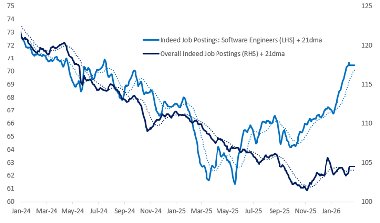
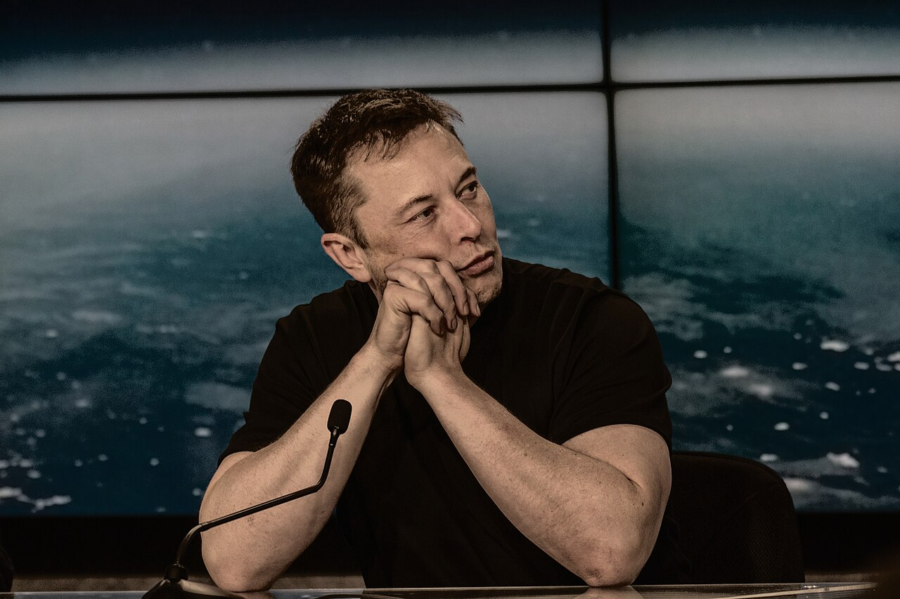

# 2026的AI，是反对唯证书主义者的春天

> 过去几年，关于人工智能最流行的一种恐吓，是“AI会让大量工作岗位消失”。 这句话听起来残酷有力，很适合被反复传播。
> 但进入2026年，越来越多公开数据正在提醒我们：这个判断并不成立。更准确的说法是，**AI正在重写岗位结构、改造能力门槛，并把原本被学历、证书、科班背景长期垄断的入场券，重新发回到大众的手里。**

先看美国。[Citadel Securities 于 2026 年 2 月发布的《The 2026 Global Intelligence Crisis》](https://www.citadelsecurities.com/news-and-insights/2026-global-intelligence-crisis/ "https://www.citadelsecurities.com/news-and-insights/2026-global-intelligence-crisis/")指出，
在“AI将立刻摧毁白领就业”的流行叙事之外，美国软件工程师招聘职位仍在快速回升，**同比上升 11%**；
文章同时援引劳动力与AI采用情况的数据，认为至少到目前为止，在现实劳动市场中没有出现所谓“迫在眉睫的大规模替代”。
换句话说，AI带来的，不是岗位真空，**而是生产率提升、任务重组和新需求扩张**。

再看中国，趋势同样鲜明，而且更加激进。
求职平台脉脉发布的[《2026春招四大风口行业直通车》](https://t.cj.sina.com.cn/articles/view/2010666107/77d8547b02001h1fk "《2026春招四大风口行业直通车》")显示，
2026年以来平台新发AI相关岗位**同比增长14倍**；技术热招岗位前三分别是算法工程师、大模型算法工程师和后端开发。
与此同时，[2026届校招和春招中](https://blog.csdn.net/EnjoyEDU/article/details/157579321 "2026大厂招聘：AI岗成绝对主角")，大厂的AI用人倾向已经不是“试水”，
而是“全面押注”：百度2026届校招发放超4000份Offer，AI岗位占比超90%；阿里2026届秋招发放7000+ Offer，AI相关岗位占比超六成，部分业务高达80%；
字节跳动2026届校招开放5000+ Offer，研发类岗位同比增长23%。这些数字共同说明了一件事：**AI并非把机会吸走，而是在重构机会的分配方式。**

## 这正是“反对唯证书主义者的春天”

所谓反对唯证书主义（Anti-Credentialism），并不是反对学习，更不是鼓吹“不读书也能成功”。
反证书主义[崇尚第一性原则， 反对死板的社会筛选机制](https://www.linkedin.com/posts/marklgabrielli_elonmusk-hiringstrategy-firstprinciples-activity-7425592584879710210-WE6W)：
只有拿到某种学历、通过某套考试、忍受某段漫长的资格训练，才被允许接近专业生产力。
过去，技术壁垒常常意味着时间壁垒、金钱壁垒和身份壁垒。
一个人要进入软件、数据、自动化、产品设计这些领域，往往先要经过数年的正规训练，再靠机构认证为自己背书。如今，AI工具正把这道人为的壁垒冲得粉碎。

最有象征意味的，不是某家巨头又扩招了多少算法岗，而是“非典型技术者”正在越来越多地闯入生产现场。
[公开报道显示](https://www.toutiao.com/article/7610575163309998655/ "文科生72小时冲上GitHub榜！不写一行代码，干翻硅谷技术大牛")，
学金融的文科生杨天润，在几乎不具备传统编程训练背景、几天前才弄清楚PR（Pull Requests 合并代码的请求）为何物的情况下，
借助 [Claude Code](https://www.claudezip.cn?utm_source=github&utm_medium=article&utm_campaign=claude-code-qidongqi "Claude Code AI 编程助手，具备强大的自动编程功能，能够大幅提升工作效率。")，在72小时内冲进 OpenClaw 项目贡献者榜前30。
这件事的价值，不在于传奇色彩，而在于它揭示了一个时际变迁的事实：
**过去需要数年积累才能触碰的技术边界，正在被AI辅助系统大幅压低。**
人类第一次可以用“目标定义、流程拆解、结果校验”的方式，调动原本只属于少数专业者的生产能力。

这就是为什么，今天真正过时的，不是某个具体职业，而是“证书崇拜”本身。
未来的分野，不再只是“有没有文凭”“是不是科班”，而是“[能不能驾驭AI，让AI乖乖听话，为我所用](use-snippets-panel.md "让 Claude Code 更听你的指挥")”。
谁更会提问，谁更会拆解复杂任务，谁更会验证结果，谁更能持续迭代，谁就更可能在新的生产体系里获得无穷的生产力杠杆。AI把普通人的能力上限抬高了，也把传统精英的护城河冲垮了。

当然，这不意味着人人都能轻松成功。**技术平权从来不等于结果平权**。
AI确实让入场门槛下降了，但它同时也把竞争推进到更残酷的一层：当人人都能调动强大工具时，人与人之间真正拉开差距的，就不再是“会不会某个固定技能”，而是更深层的人性特质。

那么，在个人能力被无限放大的时代，最重要的人性特质是什么？

## AI时代，最重要人性特质

不是死记硬背，不是服从流程，也不是把自己包装成一张漂亮简历。最重要的是，**[正确驾驭AI的能力](how-to-use-claude-code.md "Claude Code 怎么用")**。

因为AI可以生成答案，却不能替你决定什么问题值得解决；可以写出代码，却不能替你承担代码进入现实后的后果；
可以提供上百种方案，却不能替你分辨什么是真需求、什么是伪命题，什么该做、什么不该做。驾驭能力的背后，又连着几种更基础的品质：
好奇心，决定你是否愿意进入陌生领域；
行动力，决定你会不会把想法推进到现实；
诚实，决定你敢不敢承认模型会错、自己也会错；
共情，决定你做出来的东西究竟服务真实的人，还是只是在自我陶醉。

所以，2026年的AI，不是“躺赢时代”的开端，而是“个人能力大释放”的开端。
AI不是取消竞争，而是重写竞争；不是消灭职业，而是重排职业；
不是让人类退场，而是逼迫每个人重新回答一个问题：当证书不再天然代表能力，当专业壁垒被工具迅速削平，你到底凭什么证明自己？

答案恐怕越来越明晰：不是凭你过去拿过什么执照，而是凭你今天能不能用AI，把想法变成现实，再由现实产生实实在在的社会价值。

而这，正是反证书主义者真正的春天。
