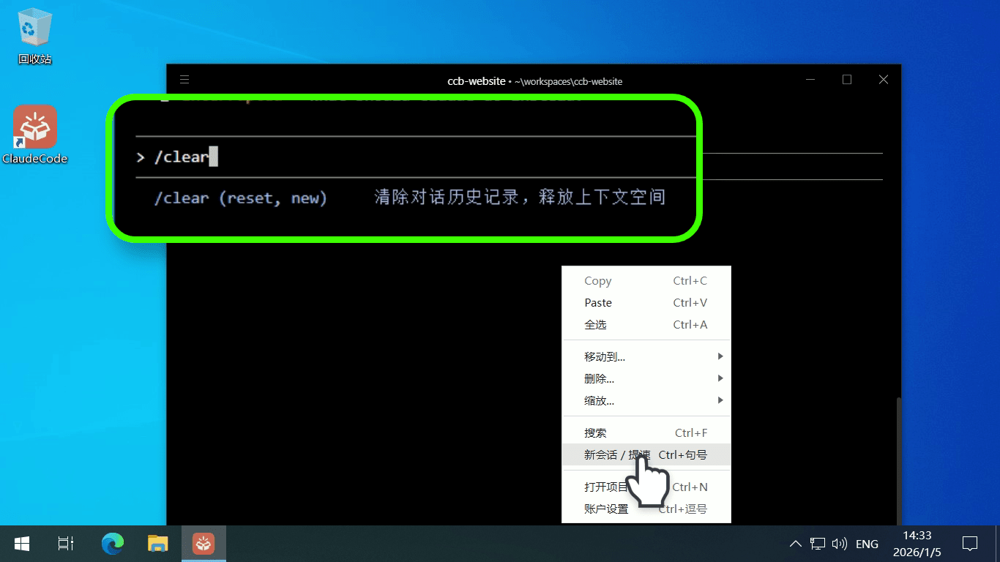
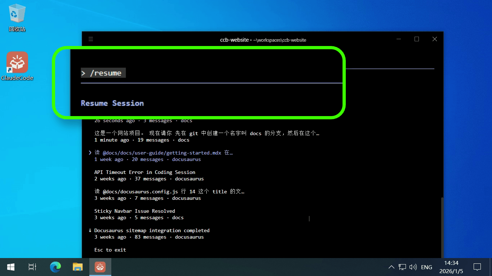

# 理解 Claude Code 的上下文与会话管理机制

在前面的文章中，我们[使用 Claude Code 执行一次完整任务的全过程，并教大家如何看懂它的各种输出信息](walk-through.md "5分钟看懂 Claude Code 在干嘛")。

在利用 Claude Code 开展人工智能辅助编程的过程中，许多开发者会发现 AI 的响应速度随任务推进而逐渐减慢。

这并非由于 AI 性能下降，而是受限于**上下文（Context）冗余**及其背后的业务逻辑。本文将解释 Claude Code 的上下文处理机制，并介绍如何通过会话管理优化开发效率。

## 一、 理解“上下文”的本质

在人工智能领域，“上下文”是模型理解当前任务的基础。由于目前的大语言模型（LLM）多以**公共基础设施**的形式提供服务，其本质上并不具备针对特定用户的长期记忆。

1.  **专家会诊逻辑**：我们可以将 LLM 的工作流程类比为医院的**专家会诊**。每次下达指令时，Claude Code 必须将当前任务连同相关的**历史信息**一并提交给模型。
2.  **“病历卡”隐喻**：这些历史信息构成了 AI 的“病历卡”。若该记录中充斥着大量无关信息（例如在同一对话中频繁切换不相关的编程模块），AI 专家在分析问题时便会因信息干扰而导致处理效率大幅下降，甚至出现逻辑偏差。

## 二、 自动压缩机制的局限性

为了缓解信息冗余，Claude Code 内置了**自动压缩上下文**的功能。当历史记录达到一定长度，系统会自动提取重点并剔除重复的文件引用。然而，该机制存在以下局限：

*   **资源消耗高**：自动压缩过程通常会占据 **20% 以上的输入字元（Token）空间**，这在处理大型项目时会造成显著的资源浪费。
*   **无法应对需求剧变**：压缩机制本质上是基于历史数据对用户意图进行**预测**，而非真正的上下文切换。如果开发者在单一会话中突然提出跨度极大的新需求（例如从后端逻辑重构转向前端 UI 微调），模型往往会因为无法准确“读心”而陷入思维混乱。

## 三、 基于“会话机制”的优化策略

实现高效人机协作的关键在于确保 AI 能够 **“一心一意，一事一办”**。Claude Code 建议将每个独立的开发任务分配到特定的 **会话（Session）** 中。

通过规范的会话管理，开发者可以利用以下指令灵活控制 AI 的专注度：

*   **初始化新任务 (`/clear`)**：
    该指令用于**清除当前对话内容**并创建一个全新的会话。这相当于为 AI 专家提供了一份空白的病历卡，使其能够完全专注于当前的新任务，不受历史干扰。

*   **恢复历史进度 (`/resume`)**：
    当需要重回之前的开发分支时，通过 `/resume` 指令可列出项目中所有的**历史会话记录**。系统会为每个会话提供一句话摘要，开发者可通过方向键精确选择并回溯到特定任务节点。若需终止选择，按 `ESC` 键即可退出。

> `/resume` 命令只能看到一句话摘要，无法浏览对话详情。如果需要 **查看完整历史消息、复制历史提示词、在多会话之间直观切换**，推荐使用功能更强的 [任务历史面板](use-task-history-panel.md)，它提供了可视化的历史记录浏览体验。

## 总结

高效使用 Claude Code 的核心在于**主动管理上下文**。通过将会话粒度精细化，不仅能节省宝贵的 Token 空间，更能确保 AI 的响应速度与逻辑准确性。

**这就好比：** 管理 AI 的上下文如同打理一个精密的**文件档案柜**。如果你将所有的草稿、方案和合同都堆叠在一个文件夹里，查找信息时必然步履维艰；但如果你为每个独立项目建立专属档案盒（Session），并在开启新业务时清空桌面，你的工作流将变得高效且井然有序。
