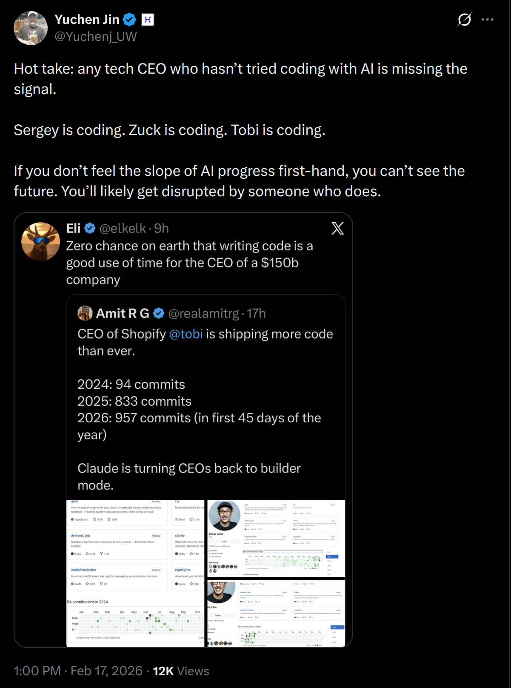

# 生产力暴涨 150%，我彻底卸载了 IDE：对话 Claude Code 创建者 Boris Cherny

> 今天看到来在 Nvidia 的 Yuchen Jin 提出一个非常激进的观点。他说：**所有没有尝试过使用人工智能进行编程的科技公司 CEO 都错过了机会**。谷歌的谢尔盖在编程，Meta 的扎克伯格也在编程，Shopify 的托比在编程。**如果你没有亲身感受到人工智能发展的速度，你就无法预见未来。你必定会被那些预见到未来的人颠覆**。
> 在 YC 播客的深度访谈中，Claude Code 的创建者 Boris Cherny 正在用亲身实践验证这一未来。他已经彻底卸载了 IDE，并实现了 100% 使用 AI 编写代码。目前，他每天提交约 20 个代码修订版本，却不再手动编辑任何一行代码。 这种模式引发了生产力的量级跃迁。自 Claude Code 推出，使用者的人均生产力暴涨 150%，远超传统模式下 2% 的年增长率。下面让我来看看 Boris Cherny 如何通过 Claude Code 重塑软件开发的生产力边界。

在 YC 播客 The Lightcone 的访谈中，[Claude Code](getting-started.md "3 分钟上手 Claude Code") 的创建者 Boris Cherny 分享了他对 AI 编程未来的核心判断。他认为[软件开发行业正在经历一场由工具演进引发的深远变革](karpathy-ai-coding-leverage.md "来自 Andrej Karpathy 的提醒：未来的程序员分两种：会用 AI 写代码的，和被淘汰的")。

以下是根据访谈内容整理的要点：

### 一、 核心趋势：“软件工程师”职能的转变
软件工程师这一职能正在发生剧变。Boris 指出，传统的“软件工程师”头衔将逐渐消失，取而代之的是“构建者”（Builder）或“产品经理”。

*   **生产力发生量级跃迁：** 自 Claude Code 推出以来，他们公司内部的人均工程生产力累计增长了 150%。 相比之下，他在 Meta 任职期间，数百人工作一年通常只能实现 2% 的提升。
*   **代码编写权的移交：** 目前他们公司内部 70% 到 90% 的代码已由 AI 编写。 Boris 个人自使用 Opus 4.5 以来，已 100% 使用 AI 编程，不再手动编辑任何一行代码。
*   **重心转向顶层设计：** 开发者的核心工作正从具体的编码转向撰写需求规格（Spec）、产品设计以及与用户沟通。 未来的工程师需要具备更强的跨职能通用能力。

### 二、 变革诱因：为未来的模型构建产品
这种职能转变的根源在于 Claude Code 是“不为今天构建，而为六个月后构建”的产品哲学。

*   **放弃过度封装：** 针对当前模型进行的手工优化（Scaffolding）通常只能带来微小的性能提升。 当下一代模型发布时，这些复杂的优化往往会被模型自身增长的能力抹平，从而变成技术债。
*   **预测功能的消亡：** 以 Plan Mode 为例，其本质只是在提示词中加入了一句“请不要写代码”。 Boris 预测随着模型自主规划能力的门槛跨越，这类特定模式在未来一个月内就可能不再需要。

### 三、 设计逻辑：顺应“潜在需求”
AI 工具的成功在于简化了用户的已有行为，而非创造新习惯。

*   **观察用户行为：** 开发者应关注用户已经在做、但做起来很费劲的事情。 CLAUDE.md 的诞生正是源于 Boris 观察到用户自发编写 Markdown 文件来引导模型。
*   **极简指令原则：** 随着模型能力的更新，所需的引导指令会越来越少。 他建议开发者定期清空 CLAUDE.md，只保留最必要的规则，让模型发挥其原生能力。

### 四、 底层驱动：永远不要跟模型对赌
团队始终遵循 AI 先驱 Rich Sutton 的“苦涩的教训”（The Bitter Lesson）。

*   **通用计算的胜利：** 历史证明，利用通用计算（搜索与学习）的方法，最终总是会胜过依赖人类知识的手工设计。
*   **快速迭代的节奏：** 团队将任何工程封装视为临时方案。Claude Code 的代码库几乎每隔几周就会被重写，目前 80% 的代码历史都不超过几个月。 这种高频重构确保了产品能紧跟模型能力的边界。

**总结**
软件开发的未来在于接受 AI 的原生能力。开发者需要保持谦逊和初心者心态，不断重新学习，因为模型能力的边界每六个月就会发生翻天覆地的变化。
