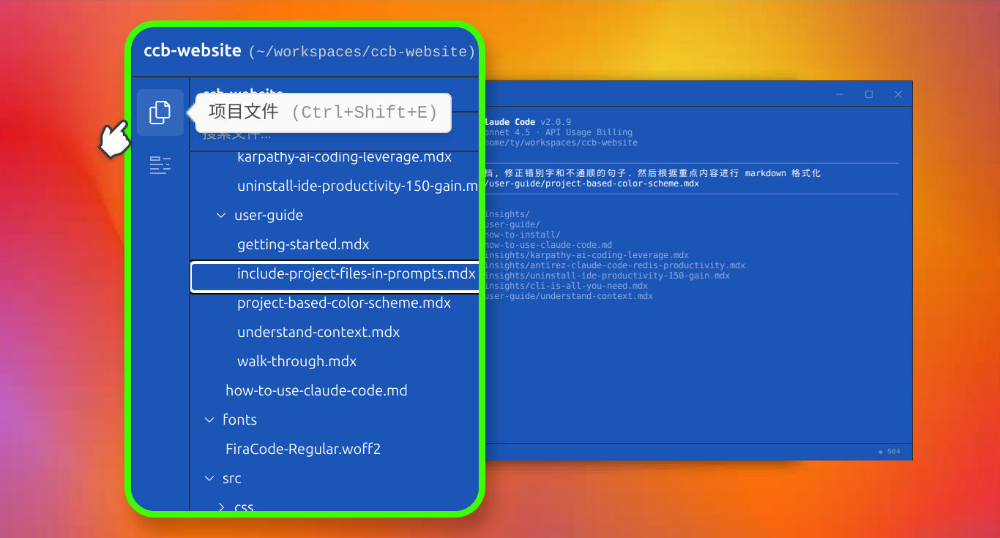
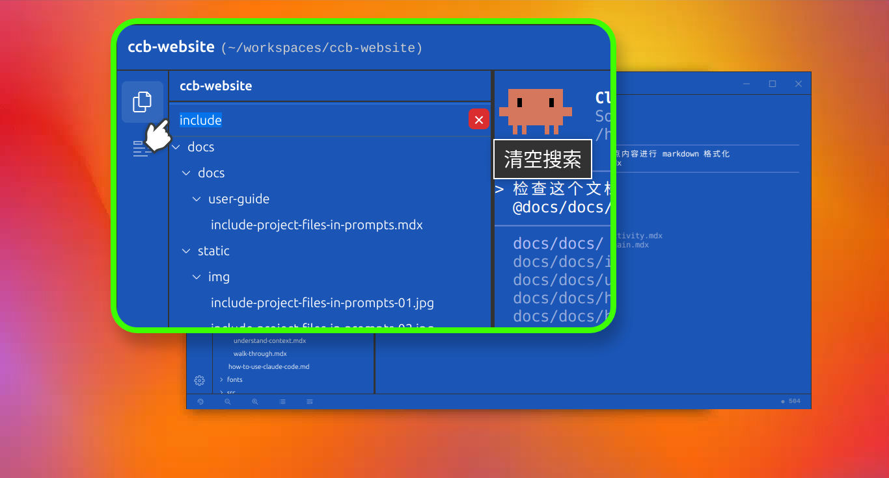

# 简单直观的文件操作：使用项目文件面板

https://github.com/user-attachments/assets/88a7cf0a-9e41-424a-b306-2aaf15753559

虽然通过命令行输入 `@` 是 [Claude Code 提供的标准引用操作](include-project-files-in-prompts.md)，旨在为 Claude 提供明确、结构化的上下文，但当需要处理的文件增多时，纯键盘输入存在显著的局限性：

*   **路径记忆负担：** 手动输入长路径不仅依赖记忆，且极易出错。
*   **中文输入挑战：** 在处理**中文文件名**时，配合拼音输入法使用 `@` 符号往往会因为全角与半角字符的切换导致交互割裂，这在实际操作中往往是一场“噩梦”。

为了解决这些痛点，[Claude Code 启动器](https://www.claudezip.cn?utm_source=github&utm_medium=article&utm_campaign=claude-code-qidongqi)提供了更加直观的**项目文件树面板**。该面板位于屏幕最左侧垂直工具条的首位，是提升引用效率的进阶方案。

## 一、 打开项目文件面板
项目文件面板是 Claude Code 交互式会话的一种增强机制。使用面板，你可以摆脱冗长的路径描述，以最直观的方式管理对话中所需的资源。
按窗口画面左上角的工具栏第一个按钮打开项目文件面板。或者通过按快捷键 `Ctrl + Shift + E` 打开这个面板。

## 二、 浏览项目文件
面板采用了开发者熟悉的树状结构，提供了与主流 IDE（如 VS Code，Cursor 等）一致的视觉体验：

1.  **所见即所得：** 你可以清晰地查看当前项目下的所有文件，无需再凭记忆猜测目录结构。
2.  **智能的内容过滤：** 面板原生支持 **Git 忽略规则**。它会自动读取项目中的 `.gitignore` 文件，并自动隐藏其中定义的忽略项（如 `node_modules` 目录），确保你始终聚焦于核心业务代码，避免杂讯干扰。
3.  **键盘辅助导航：** 除了鼠标点击，你还可以利用键盘的上下方向键在文件树中穿梭，通过左右方向键展开或折叠目录。

## 三、 高效搜索文件

对于结构极其复杂的项目，面板提供了高响应性的全局搜索功能：

1.  **即时过滤：** 目录上方内置了搜索框，只需输入文件名的关键词，面板就会快速过滤并定位目标文件。
2.  **毫秒级定位：** 这种方式避开了逐层寻找目录的繁琐，在处理深层嵌套的项目结构时尤其高效。

## 四、 快速插入文件引用
这是提升提示词编写速度的核心环节，面板支持多种快捷引用方式：

1.  **高效的双击机制：** 在面板中找到目标文件或目录后，通过**鼠标双击**操作即可将其引用直接插入到对话框中。Claude 会自动获取指定文件或资源的内容并将其包含到当前的上下文中。
2.  **一键批量引用：** 在进行代码审查或多文件对比时，你可以通过连续的双击或配合键盘回车键（Enter），快速将多个文件（如 `@file1.js` 和 `@file2.js`）加入到提示词中。
3.  **区分文件与目录：**
    *   引用**特定文件**会包含该文件的完整内容。
    *   引用**目录**则会提供该目录的文件列表信息，方便你随后指引 Claude Code 读取目录下的所有或特定类型的文件。

## 总结
对于追求极致效率的开发者而言，**图形界面文件树面板**不仅是 [ `@` 命令行操作](include-project-files-in-prompts.md)的有力补充，更是处理复杂引用场景时的首选方案。它将路径查找、中文字符输入及文件过滤等繁琐环节进行了视觉化整合，极大地节省了编写提示词的时间。建议在日常开发中优先使用左侧工具条的第一个按钮，开启更直观、更高效的 AI 编程交互体验。
