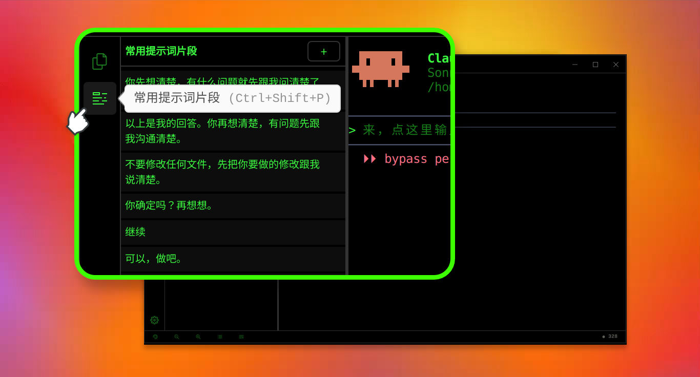
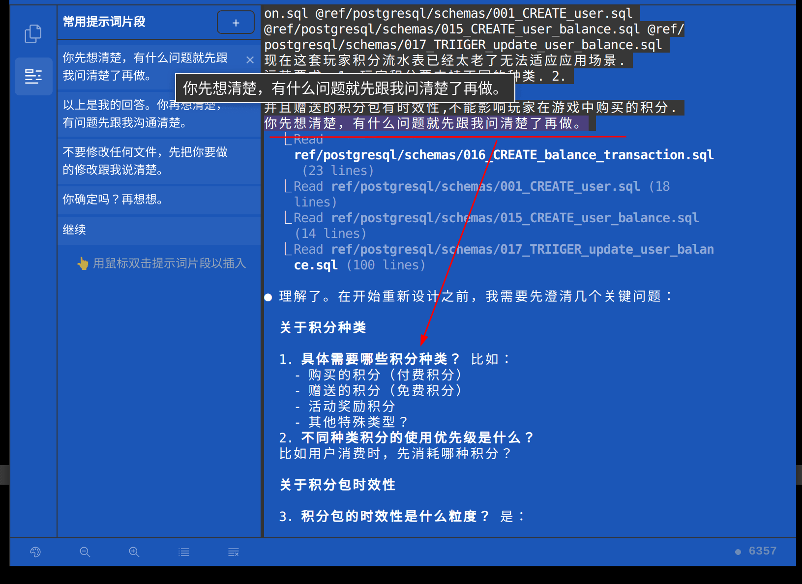
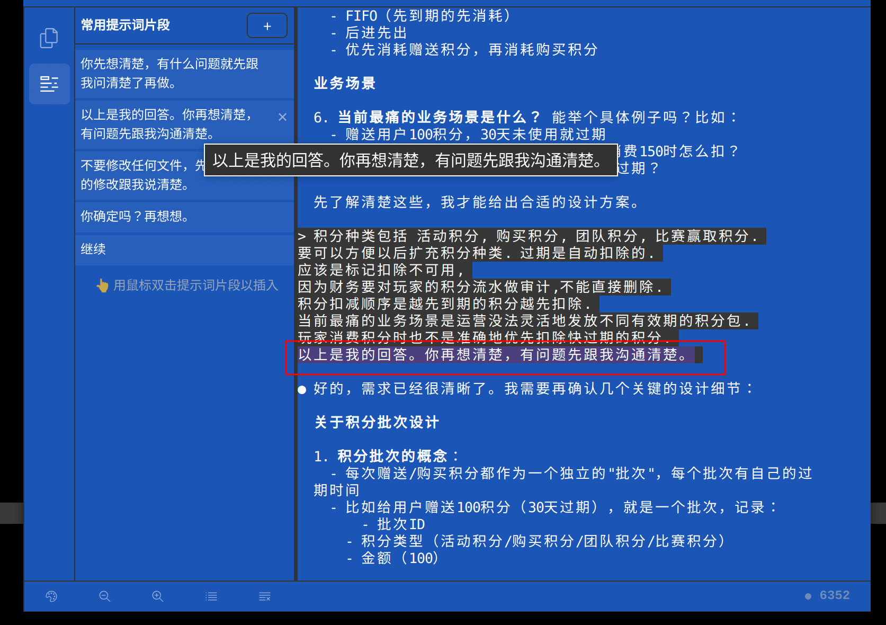
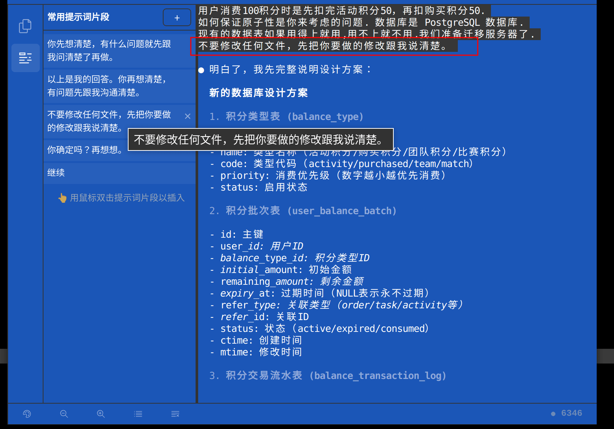

# 常用提示词面板：让 Claude Code 更听你的指挥

https://github.com/user-attachments/assets/3e057d61-35f8-4982-bbf3-9dfcf90e2913

## 常用提示词面板

**常用提示词面板**，就是 Claude Code 里专门用来管理“常用提示词片段”的一个小工具。用好这个面板，**不仅能帮使用者避免重复输入，节省大量时间，更能让 Claude Code 认真听从使用者的指挥**。

* 常用提示词面板的位置：在 **左侧工具条** 上的 **第 2 个按钮**
* 打开方式：

  * 点击左侧工具条上的第 2 个按钮，或
  * 使用快捷键 **`Ctrl + Shift + P`**



打开以后，使用者会看到一个面板：

* 上面已经预置了一些官方提供的、常用又有用的提示词片段；
* 用鼠标 **双击某一条提示词**，这条提示词就会被自动插入到当前的任务对话输入框中；
* 面板右上角有一个 **「＋」按钮**，用来添加使用者自己的常用提示词。

使用者可以把自己在项目中经常用到的提示词片段记录进去。
以后再需要时，只要鼠标双击一下，就能把这一整段提示词插入当前对话，省掉重复输入的麻烦。

简单理解：**常用提示词面板 = 个人的提示词收藏夹 + 一键粘贴工具**。

## 如何用好常用提示词

### 1. Claude Code 为什么看起来“开始自说自话了”？

在 Claude Code 里，使用者每发起一次看似简单的请求，背后往往并不是“一次 LLM（人工智能大语言模型）调用就结束”。

从 Claude Code 的工作流程来看：

* 为了帮使用者完成一个任务，它 **平均要调用[至少十几次 LLM 推理](https://arxiv.org/abs/2602.21548 "multi-turn, agentic LLM inference")**
* 复杂任务会被拆成很多小步骤，每一步都有自己的推理和决策
* 只要中间某一步的理解稍微偏一点，后续步骤就会在这个偏差之上继续滚雪球

如果使用者给的是一个有计划、有阶段的复杂任务，那在每个阶段里又会有好几次 LLM 推理。
**只要每个阶段都有那么一两步偏离了使用者心里真正的想法，整体就会给人一种：Claude Code 越做越不对劲、好像“自说自话”了**。

所以问题不是 Claude Code “不听话”，而是：

> **使用者心中所预期的的目的** 和 **Claude Code 理解到的计划**，中间常常有偏差。
> 一旦缺乏明确地纠正和约束，这个偏差就会在多轮推理中不断地被放大。

### 2. 常用提示词的作用：让 Claude Code 吃透使用者的意图

我们其实已经有很多经验性的“好提示词”——
比如：

* 先让模型把问题厘清楚再干活
* 让模型拿到使用者的回答后，再反思有没有理解错
* 让模型先 dry-run（干跑），把要改的内容讲清楚，再真正动手写代码或改文件

这些话使用者可以每次都手打一遍，但：

* 手打很费时间
* 有时懒得打，就省略了这一步“对齐过程”
* 一旦省略，对齐就变差，Claude Code 就更容易跑偏

**常用提示词面板的价值就在这里：**

* 把那些已经验证有效的“控制型提示词”保存成片段
* 日常使用时，**只要鼠标双击一下，就能给当前任务加上这些 Buff**
* 让“先确认、再执行、执行前干跑”这套流程变成一种习惯性操作，而不是临时想起来才用

用一句话总结：

> 常用提示词面板，让使用者可以 **用最低成本，持续地把 Claude Code 拉回使用者的预设计划轨道上**。

### 3 实战：三类推荐的“控制型提示词 Buff”

下面这三条提示词，就是非常适合作为「常用提示词片段」存在面板里的范例。
它们对应的是三个阶段：**先想清楚 → 多轮确认 → 真正动手前 dry-run**。

#### 1）“核对脑子”：让 Claude Code 先把问题想明白



**提示词片段：**

```
你先想清楚，有什么问题就先跟我问清楚了再做。
```

**适用场景：**

* 在给 Claude Code 开新任务时
* 比如：让它实现一个复杂功能、重构一大块代码、或按步骤完成一整套工作流

**效果：**

加上这句话后，Claude Code 通常会：

* 先把使用者描述的任务拆解一下
* 主动列出它觉得不确定、有疑问、需要使用者确认的地方
* 在开工前，把双方的预期尽量对齐

相当于使用者对它说：**“别一上来就干，先把需求问清楚。”**

#### 2）“回答并二次确认”：让它对使用者的回答再思考一轮



**提示词片段：**

```
以上是我的回答。你再想清楚，有问题先跟我沟通清楚。
```

**适用场景：**

* 当 Claude Code 问了一堆问题，使用者已经给了详细回答
* 但使用者知道：这么复杂的事，**只靠一轮问答，很可能还是没完全对齐**

**效果：**

在使用者回答完之后，附上这条提示词，可以让 Claude Code：

* 再对使用者的回答进行一次整体理解和校对
* 发现自己仍然不确定、或逻辑上有冲突的地方
* 如果有疑问，会再抛出问题继续确认，而不是直接误解后开干

这一步的本质是：**多一轮认知上的“自我校验”**。
对复杂任务来说，这一轮的价值会非常大。

#### 3）“干跑（Dry-run）”：先说怎么改，再真正改



**提示词片段：**

```
不要修改任何文件，先把你要做的修改跟我说清楚。
```

**适用场景：**

* 已经把需求讲清楚了，Claude Code 也确认没问题了
* 接下来它准备开始着手实施、修改多个文件

这时候，直接让它改，**内心难免有点慌**：
万一有一点理解偏差，文件被改乱了，再要去回退修改很麻烦。

**效果：**

加上这条 dry-run 提示词后，Claude Code 会：

1. 先给出一个“将要执行的操作清单”，例如：

   * 要修改哪些文件
   * 每个文件里准备做哪些类型的改动
   * 哪些地方会新增、删除或重构
2. 使用者可以先审一遍这个计划，如果哪里不对，及时打断并修正
3. 等使用者确认「可以，做吧。」，再让它真正去执行

这相当于在真正输液前，先让医生告诉使用者他打的是什么药、剂量多少、先做哪一步。

## 总结

尽量把 Claude Code 当成一个人来使唤。让 Claude Code 做事前，跟它确认沟通清楚，然后就可以放心地交给它去干。
善用常用提示词面板，不仅省心又省力，还能让 Claude Code 更懂你。
