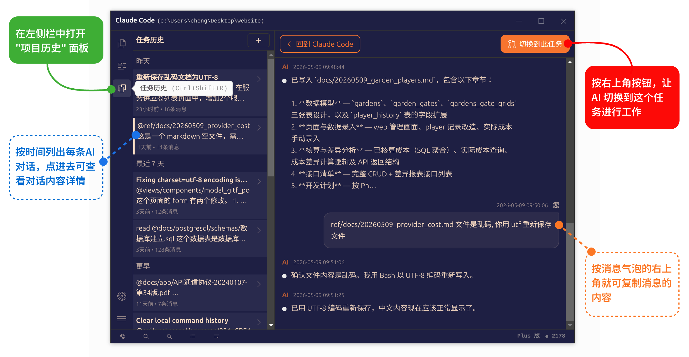

# 任务历史面板：浏览 Claude Code 的完整任务对话，让 AI 编程更连贯

https://github.com/user-attachments/assets/d2051fbf-1aef-47f6-8dab-e8ae131c0b1c

## Claude Code 自带的 `/resume` 命令不好用

在使用 Claude Code 时，一个常见的场景是：**需要回到之前完成了一半的任务，继续之前的工作**。

为此，Claude Code 内置了 [`/resume` 命令](understand-context.md)。该命令能够列出当前项目下所有的历史会话记录，并通过方向键选择想要恢复的任务。按下回车后，Claude Code 便会重新加载该会话的上下文，让使用者可以从上次中断的地方继续。

然而在实际使用中，`/resume` 命令的局限性逐渐暴露出来：

- **历史记录仅显示一句话摘要，看不到具体内容。** 很多任务名称本身高度概括（例如 "完成第三步"），时间一久根本无法从摘要判断这个会话里到底聊了什么。
- **无法复制历史消息。** 在日益自动化的的开发过程中，使用者可能积累了很有价值的提示词或讨论内容，想在新任务中复用，却只能眼睁睁看着这些内容停留在历史会话里，无从下手。
- **无法直观地在历史记录之间切换。** `/resume` 一次只能恢复一个会话，使用者必须先退出当前对话，再去列表里反复翻找，操作路径冗长，体验割裂。

这些问题的本质是：**`/resume` 命令提供的是一套「命令行式的黑箱」——你只能看到一个标题，无法窥见内部的内容。** 对于需要频繁回溯历史的开发者而言， `/resume` 指令无疑是在时间浪费。

为此， [**Claude Code 启动器 v1.5.0 版本**](https://www.claudezip.cn?utm_source=github&utm_medium=article&utm_campaign=claude-code-qidongqi "Claude Code 免安装启动器")新增了**任务历史面板**，将使用者与AI之间所有历史记录以透明直观的方式呈现，让使用者能够一目了然地浏览、管理和复用历史对话内容。

## 打开任务历史面板

任务历史面板位于左侧工具条的第 3 个按钮。打开方式有两种：

- **打开方式一**：点击左侧工具条上的第 3 个按钮
- **打开方式二**：直接按快捷键 **`Ctrl + Shift + R`**

打开后，任务历史面板会从 Claude Code 窗口的左侧滑入。使用完毕后，再按一下工具条上的按钮，或再次按 `Ctrl + Shift + R`，即可收起面板，回到正常对话界面。

## 使用任务历史面板

任务历史面板采用了**左右分栏**的布局设计，两个区域协同工作，共同完成历史任务的浏览与管理。

### 左侧：历史记录列表

左侧列表展示当前项目下所有的历史会话记录，按时间倒序排列，最新的会话排在最上方。

每一条记录在列表中呈现为一个独立的条目，点击即可选中。选中后，该条记录会在视觉上高亮显示，右侧面板随即加载该会话的详细内容。

如果历史会话数量较多，列表支持滚动浏览。使用者可以通过鼠标滚轮或触摸板滑动，快速定位到目标记录。

### 右侧：会话详情面板

点击左侧任一历史记录后，右侧面板会展开该次会话的完整对话内容。

面板中完整呈现了使用者与 Claude Code 之间的每一轮交互：使用者的提问、Claude Code 的分析思路、执行的命令、修改的文件……所有内容都按时间顺序逐一展示，脉络清晰可追溯。

在这个视图下，使用者可以：

- **通读历史对话**：了解上次任务做到了哪一步、Claude Code 给出了哪些建议、哪些文件被修改过。
- **评估任务状态**：判断这个会话是否值得恢复，还是只需要复制其中某段内容用于新任务。
- **提取有价值的信息**：找到历史消息中积累的优质提示词、需求描述或技术讨论，留待后续复用。

## 复制消息：复用历史提示词

历史对话中往往沉淀了大量有价值的思考——需求分析、技术方案、提示词模板，都是可以复用的宝贵资产。

任务历史面板为每一条消息气泡都内置了**复制按钮**。按钮位于消息气泡的右上角，将鼠标悬停在该消息上即可看到。

点击复制按钮，该条消息的完整文本内容会被复制到系统剪贴板。使用者可以：

- 将历史提示词直接粘贴到当前任务中，让 Claude Code 以历史积累的上下文为基础继续工作；
- 将其他会话中的优质提问或指令提取出来，[创建为常用提示词模板](use-snippets-panel.md "常用提示词面板：让 Claude Code 更听你的指挥")，以后就能一键复用，省时又省心。
- 把 Claude Code 曾经给出的技术方案或代码片段复制到文档或笔记中留存。

整个复制过程无需切换窗口，在面板内即可完成，操作路径极短。

## 切换到任务：无缝衔接继续工作

如果确定要回到某个历史会话继续工作，任务历史面板提供了**一键切换**的便捷入口。

切换按钮位于右侧会话详情面板的右上角，标注为"**切换到此任务**"。

点击该按钮后，Claude Code 将执行以下操作：

1. 关闭任务历史面板；
2. 清除当前的对话上下文；
3. 加载目标历史会话的完整上下文；
4. 自动进入该任务，等待使用者继续发出指令。

整个切换过程由面板自动引导，使用者无需手动输入任何命令。相比 `/resume` 需要先记住命令、再在列表中反复翻找的繁琐流程，任务历史面板的切换操作路径更短、更直观，尤其适合多任务并行、需要频繁在不同会话间跳转的开发者。

## 任务历史面板与 `/resume` 命令的对比

|  | `/resume` 命令 | 任务历史面板 |
|---|---|---|
| 展示内容 | 仅显示一句话摘要 | 展示完整对话内容 |
| 能否复制消息 | 不能 | 可以，每个消息气泡均可复制 |
| 切换方式 | 方向键选择 + 回车确认 | 点击"切换到此任务"按钮 |
| 操作入口 | 需在命令行输入命令 | 工具条按钮或快捷键 `Ctrl + Shift + R` |
| 多会话比较 | 只能逐一查看，无法横向比较 | 可同时浏览多个会话的标题，快速定位目标 |
| 适用场景 | 快速恢复一个已知会话 | 需要浏览、比较、提取内容的复杂场景 |

两者的定位可以互补：对于简单的恢复场景，`/resume` 仍然可用；而对于需要浏览、比较、提取内容的场景，任务历史面板则是更优的选择。

## 总结

任务历史面板将 Claude Code 的历史会话从「命令行黑箱」变为「可视化界面」，从根本上解决了 `/resume` 命令信息不透明、操作路径冗长的问题。通过这个面板，使用者可以：

- **一目了然**：以透明直观的方式浏览所有历史会话，无需猜测摘要代表的实际内容；
- **随手复用**：一键复制历史消息中的优质提示词和讨论内容；
- **无缝衔接**：点击按钮即可切换到目标任务，无需记忆命令。

善用任务历史面板，让 AI 编程的工作流更加连贯、高效。
