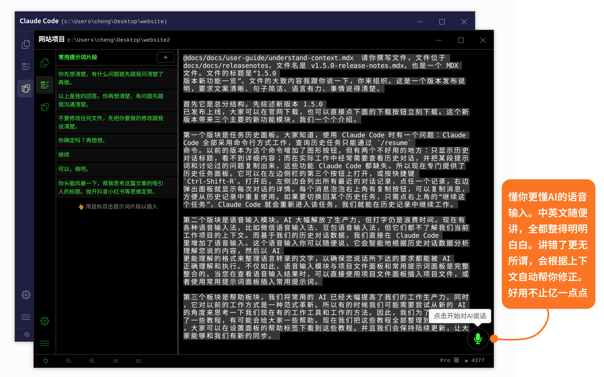

# 使用 Claude Code 的语音输入：想到什么说什么，好用不止亿点点

人工智能极大地解放了生产力，但"打字"这件事本身仍是一项时间成本。日常有微信语音输入法、豆包语音输入法等多种选择，但它们都存在一个共同的盲区：**不了解使用者当前工作的项目上下文，无法做出真正贴合语境的转录**。

> 而您真正需要的，不是让电脑转录您说了啥 —— 而是让 AI 理解您想做什么。

[Claude Code 启动器](https://www.claudezip.cn?utm_source=github&utm_medium=article&utm_campaign=claude-code-qidongqi)将语音输入直接内置进界面，从根本上解决了这个问题。

## 为什么普通语音输入法不适用

### 目的不同

市面上的语音输入法是**为日常生活设计的工具**，面向的是聊天、备忘、发消息等场景。它的任务忠实地把您说的每一个字转录出来，越准确越好。

但当您用语音操控 AI 编程时，场景完全不同了。您不是在"记录自己说了什么"，而是在"让 AI 明白您想做什么"。这两个目标有根本性的差异：

- 生活中语音输入："我要去那个店" → 转录为"我要去那个店"
- AI 编程语音输入："帮我把昨天改的那个配置文件的端口改成 8080" → AI 需要知道"昨天改的配置文件是哪个"、"端口字段在哪里"、"8080 是新值"……

普通输入法能忠实记录每一个字，却无法理解您说的内容指向哪里。

### 方式也不同

人类的思维方式是**发散型跳跃式**的：想到什么说什么，前后不一定严格按逻辑顺序，有时说到一半又推翻前面的内容，有时一句话还没说完就想到了另一个补充。

而目前主流的语音输入法都是**流式线型转录**——您一边说，它一边实时输出文字。这种方式对聊天没问题，但对操控 AI 工作流反而带来了麻烦：

- 说到一半改变主意，前面说的一半内容就会污染最终的提示词；
- 发散的想法被忠实地按顺序记录下来，导致转录结果混乱、缺乏条理；
- 想到什么说什么的节奏被线性的转录过程打乱。

这就好比您脑子里是一个思维导图，但普通输入法只能输出线性文本——中间丢失了大量信息。

## Claude Code 的语音输入模块：专为 AI 控制设计

### 智能语境理解

语音输入模块的转录结果，会经过 AI 智能分析，并结合**当前对话上下文**和**项目文件信息**进行二次整理。

这意味着：

- 您语音中提到的文件名、目录名、变量名，系统会自动找到上下文中实际存在的对应内容并替换；
- 说到一半被否定的内容，系统会自动过滤掉；
- 跳跃的发散想法，会被重新按重要程度和内在逻辑关系组织成清晰的文字。

举个例子：您在处理一个叫 `config/app.yaml` 的配置文件，想让 AI 把端口改成 8080。您对着语音输入说：

> "把配置文件那个 app 就是你之前搞的那个文件，端口改成 8080，之前好像改过一次但是好像没生效……"

普通输入法会把这段话忠实地转录出来，而 Claude Code 收到的是一个已经被整理过的、语义清晰的指令：

> "把 config/app.yaml 配置文件中的端口（port）字段修改为 8080。"

### 想到什么说什么，说错了也没关系

这是语音输入模块的核心体验。

普通输入法要求您**字斟句酌**：因为每一个字都会被忠实记录，说错了就得重新来。

而语音输入模块的设计哲学正好相反——**随便说，说错了也无所谓**。系统会自动处理以下情况：

- **说到一半改口**：前面说错的内容会被自动丢弃，不影响最终输出；
- **用代词指代**："那个文件""昨天改的""刚才那个"，系统会根据上下文找到真实指代；
- **内容重复**：说重了的内容会被自动去重；
- **语气词过滤**："呃""那个""嗯"等语气词会被自动剔除。

您要做的只是把大概意思说出来，剩下的交给系统。

### 中英文混合输入

开发中经常会在中文里夹带英文：文件名、目录名、函数名、框架术语……这些内容在纯中文的语境中频繁出现。

普通语音输入法在处理"中文里夹英文"时往往力不从心，经常把英文单词识别错误，或把一个完整的英文术语拆成不知所云的汉字。

语音输入模块内置了针对编程语境的优化，会根据当前项目的文件结构，自动识别并正确保留英文内容：

- 文件名（如 `useSnippets.ts`、`src/utils/index.ts`）不会被拆碎；
- 英文变量名、函数名会被正确识别；
- 框架术语（如 `Java`、`C++`、`npm`、`git` 等）识别准确。

### 时间充裕，不用赶

微信语音最长只能录 1 分钟，很多人录着录着就开始紧张，时间到了被迫中断。

语音输入模块支持最长 **5 分钟**的连续录音。您可以边想边说，节奏完全由您掌控，不用担心时间到了被打断。

## 如何使用

语音输入模块常驻在 [Claude Code 启动器](https://www.claudezip.cn?utm_source=github&utm_medium=article&utm_campaign=claude-code-qidongqi)窗口的**右下角**，无需打开任何面板，随时可用。

### 第一步：打开录音

将鼠标移到窗口右下角的录音按钮上，会显示操作提示。点击按钮即可开始录音。

### 第二步：说话

开始说话时，录音按钮会显示**音量波动动画**，实时展示当前音量大小。您的语音正在被实时捕获。

在整个录音过程中，您可以：

- 想到什么说什么，不用在意顺序和逻辑；
- 说错了直接纠正或忽略，系统会自动处理；
- 说到一半停下来思考，录音不会中断，继续说即可。

### 第三步：结束录音

再次点击同一个按钮，结束录音。系统将音频内容上传并开始转录处理。

### 第四步：确认并发送

转录完成后，系统会展示处理后的文字内容供您确认。在这个确认界面中，您可以：

- 看到经过 AI 整理后的最终文字，检查是否准确反映了您的意图；
- 如有需要，直接在确认框中修改文字内容；
- 从[**项目文件面板**](use-file-explorer.md "简单直观的文件操作：使用项目文件面板")插入文件引用，丰富提示词内容；
- 从[**常用提示词面板**](use-snippets-panel.md "常用提示词面板：让 Claude Code 更听你的指挥")插入预置提示词模板；
- 确认无误后，点击**发送按钮**将内容发送给 AI。

整个操作流程无需切换窗口，一气呵成。

## 与传统语音输入法的对比

|  | 微信 / 豆包等通用语音输入法 | Claude Code 语音输入模块 |
|---|---|---|
| **设计目的** | 日常生活（聊天、备忘） | 操控 AI 编程，理解您想做什么 |
| **转录方式** | 流式线型转录，边说边出字 | AI 语境理解式转录，自动整理后输出 |
| **思维方式** | 适合线性表达，字斟句酌 | 支持发散跳跃式表达，想到什么说什么 |
| **处理"说错"** | 说错只能重新来 | 说错无所谓，自动过滤并修正 |
| **中英文混合** | 英文识别较弱，容易拆碎 | 自动识别编程术语，正确保留 |
| **时间限制** | 微信最长 1 分钟，有时间压力 | 最长 5 分钟，充足从容 |
| **与项目整合** | 不了解项目上下文 | 深度整合文件面板和提示词面板 |

## 总结

语音输入模块重新定义了"语音输入法"在 AI 编程中的角色——它不是把您说的话变成文字的工具，而是**把您的想法翻译成 AI 能够精准理解和执行的指令**的助手。

用好这个模块，只需要记住一句话：

> **随便说，剩下的交给系统。**
