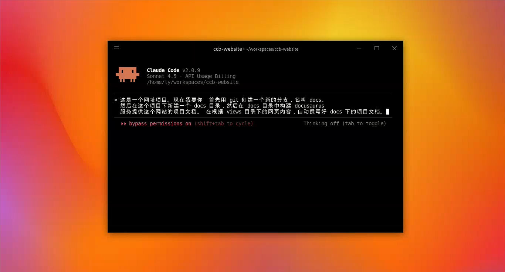
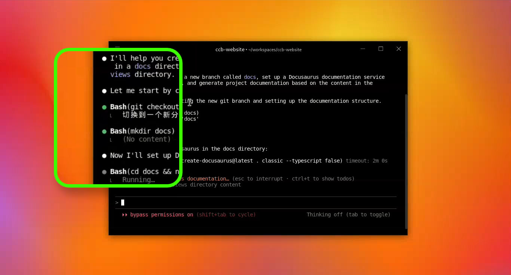
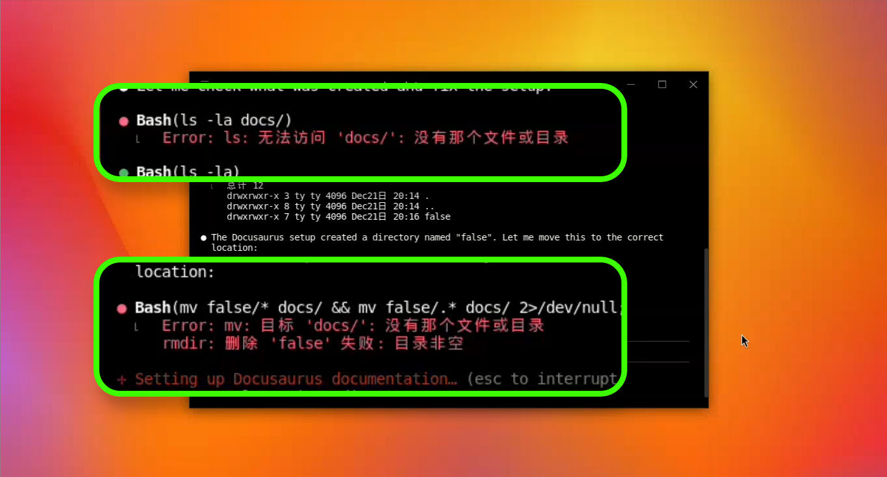
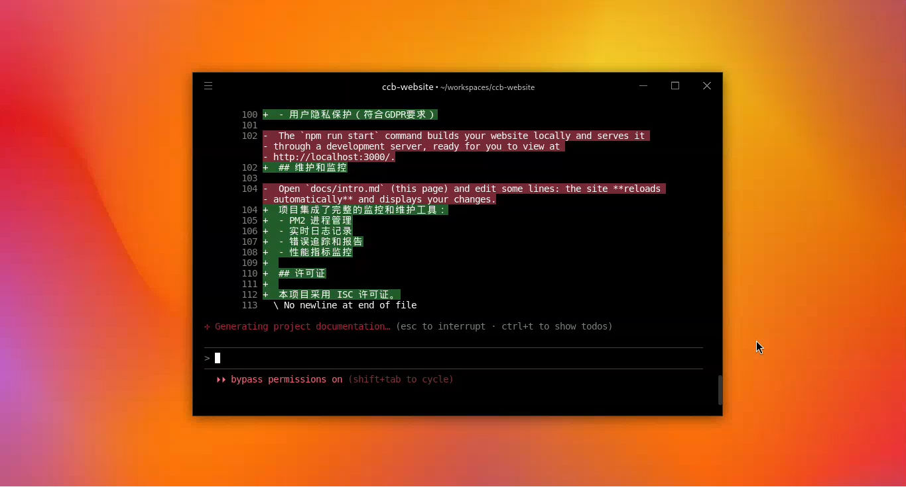

# 实战演练：5分钟看懂 Claude Code 在干嘛

在前面的文章中，我们分享了如何在[三分钟内完成 Claude Code 的安装](how-to-use-claude-code.md "免安装使用 Claude Code")。下面，我将带大家深入实战，演示使用 Claude Code 执行一次完整任务的全过程，并教大家如何看懂它的各种输出信息。

在 AI 编程圈，很多博主喜欢展示“一句话生成酷炫网页”，但在实际开发中，缺乏约束的发挥往往难以落地。**Claude Code 的核心强项在于它能贴合任务情景，像一个有记性的“监工”一样高效工作**。

## 本次任务目标
我们将要求 Claude Code 执行以下流程：
1. **分析网站内容**；
2. **自动搭建一个 Docusaurus 文档系统**；
3. **编写 [Claude Code 启动器](https://www.claudezip.cn?utm_source=github&utm_medium=article&utm_campaign=claude-code-qidongqi)的使用文档**；
4. **确保未来能方便地更新文档**。

---

## 第1步：启动与指令下达

首先，我们打开桌面上的 [**Claude Code 启动器**](https://www.claudezip.cn?utm_source=github&utm_medium=article&utm_campaign=claude-code-qidongqi "Claude Code 免安装启动器")。这个启动器最方便的地方在于它是免安装的，并且已经预封装好了所需的软件环境，下载即可使用。

进入工作画面后，在输入区（即显示“来，点这里输入”的灰色文字处），我向 Claude Code 下达了三段核心指令：
* **创建 Git 分支**：确保万一搞砸了可以随时撤回。
* **安装 Docusaurus**：这是我们要使用的文档服务框架。
* **分析并写作**：让它阅读当前代码，自动生成文档结构和内容。

## 第2步：读懂 Claude Code 的“语言”

按下回车后，任务正式开始。要掌握 Claude Code，关键是看懂画面中的圆点符号和图标：

*   **白色圆点**：代表 Claude Code 的反馈，表示它已经完成的事情或正在思考的逻辑。
*   **绿色圆点**：代表**工具调用成功**。当它成功操作某项工具时，就会显示绿色。
*   **橘红色星号**：这是它的“施法吟唱”，代表正在思考。如果星号长时间不动，通常意味着网络连接出现了问题。
*   **技巧提示**：如果某一步的信息太多，它会折叠显示。你可以通过 **Ctrl + O** 展开查看技术细节，看完后再折叠起来。

## 第3步：面对错误与自纠能力

在执行过程中，你可能会看到**红色圆点**，但这并不代表失败。AI 也会犯错，例如在本次演示中，它在创建目录时命令行多了一个 false 字样，导致 Claude Code 的下一步工具调用时找不到对应的路径。

**Claude Code 最专业的地方在于它的“监督功能”**：它会严密检查输出是否符合预期。一旦发现不对，它会立刻分析历史记录并**自动修正**，无需人工干预即可解决目录问题。

在修改文件时，它会展示清晰的对比色：**绿色区块代表新增内容，红色代表删除内容**，修改细节一目了然。即使在生成网页时遇到 CSS 编译超时，它也会自动分析异常并尝试重试。

## 任务结果与总结

最终，Claude Code 交付了一份令人满意的成绩单：**中文本地化配置完成、侧边栏搭建完毕、页面内容框架也已准备就绪**。

总结来说，Claude Code 不仅仅是一个会写代码的程序专家，它更像是一个**全程盯着进度的智能助手**。它具备自检自纠的能力，即使过程出现小差错，也能通过自我修正完成任务，真正做到了省心和贴心。

**理解 Claude Code 的运行逻辑，就像是观察一个经验丰富的工头：** 白色圆点是他的口头汇报，绿色圆点是他熟练地拿起了扳手，而当他偶尔敲错钉子（红色圆点）时，他能立刻意识到并自己修正，而不需要你在一旁时刻纠错。
